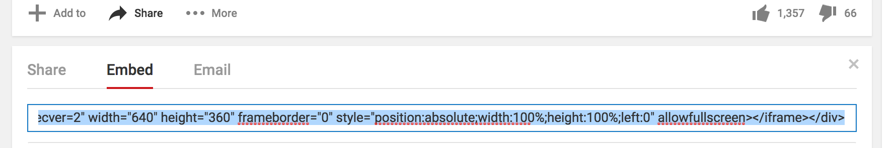

1. Bonus: add a video! YouTube provides an easy way to **embed** (put) videos from it onto your website. Find a video on YouTube that you want to show on your website. 
2. Look for the "Share" button and click it. Select the option "Embed".
3. You will see a textbox with all the text selected \(if you accidentally unselect the text, you can select it all again by clicking on it and pressing the **Ctrl** \(or **cmd**\) and **A** keys together on your keyboard, just like before\). Press the **Ctrl** \(or **cmd**\) and **C** keys together on your keyboard to **copy** the text.
4. Then go your code window, and click in the place where you want to put the video, for example below a closing `
` tag. Paste the code by pressing **Ctrl** \(or **cmd**\) and **V** on your keyboard at the same time, as usual. Don't worry about understanding all the code you just pasted! Click Run to see the video appear on your web page.
5. The same technique works for Google maps as well. Give it a go! Go to dojo.soy/google-maps and search for a place you want to show on your website. Click on the result, then find the Share button and get the code and add it to your website as above. 
6. If you look carefully you should be able to find a `width` attribute in the pasted code. You can change its value to make the map appear bigger or smaller.

