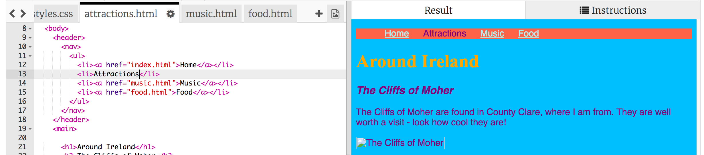

1. By adding more **CSS** rules in the stylesheet, you can transform your navigation menu into a cool looking menu bar! 
2. Go to the stylesheet file. Remember it is in the styles.css tab. Add the following rule at the end of the file.
   ```
      nav ul {
         background-color: tomato;
      }
   ```
3. Notice how you used **two selectors** instead of one? If you used the `ul` selector on its own, the rule would affect all unordered lists on your website. Adding the `nav` selector as well makes it only apply to lists that are in between `nav` tags.
4. Click Run to see what it looks like. 
5. Let's get rid of the bullet points. These are the spots in front of each list item. Go to the styles.css tab and add the following at the end of the file.
   ```
   nav ul li {
      list-style-type: none;
   }
   ```
Notice this set of rules has _three_ selectors! It selects all `li` elements that are in a `ul` list which is inside a `nav` section.
6. Now let's make the list horizontal instead of vertical. Inside the new set of rules, add the following line: `display: inline;` Let's also add the properties `margin-right` and `margin-left` to space the menu items out a bit. The rules should look like this now:
   ```
   nav ul li {
      list-style-type: none;
      display: inline;
      margin-right: 10px;
      margin-left: 10px;
   }
   ```
   Remember `10px` means 10 **pixels**.
7. How about making the menu change to to tell you which page you are on? This part won't be in the stylesheet.
8. Let's start with the homepage. Go to the index.html file. In the list, remove the link tags before and after the word "Home", so that the list item for the homepage is just text in between `<li> </li>` tags, like this `<li>Home</li>`.
9. Now go to each of your other files, and do the same thing, each time removing the link tags for the page you are editing. So on the music.html file, remove the link tags in the "Music" list item, and so on. 
