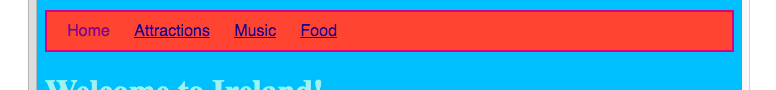

1. Met CSS, zijn de mogelijkheden om je menu balk er leuk te laten uitzien oneindig. Open het styles.css bestand opnieuw \(de plek waar alles gebeurt!\) Elke keer dat je een verandering maakt, klik op 'Run' om te zien hoe het er uit ziet op je website.
2. Zoek je `nav ul` selector en voeg meer regels als deze toe:
   ```css
      nav ul {
        background-color: tomato;
        border-style: solid;
        border-color: MediumVioletRed;
        border-width: 2px;
        padding: 10px;
      }
   ```

   De `padding` eigenschap voegt ruimte toe. Kan je uitwerken wat de andere eigenschappen doen? Experimenteer maar met verschillende kleuren en getallen voor je pixels. 
3. Om de onderlijning van je links weg te krijgen, voeg de volgende code toe op een nieuwe regel na de accolade`}` vóór de regels `nav ul li`.
   * Je kan het na elke `}` maar het is een goed idee om alles bij elkaar te houden dat iets met elkaar te maken heeftut it's a good idea to keep related stuff together so it's easier to find!
     ```css
      nav ul li a {
         text-decoration: none;
      }
     ```

     De bovenstaande regel is van toepassing bij _links_ \(`<a>` tags\) binnenin _list items_ in an _unordered list_ inside a _navigation_ \(`nav`\) section. Wow! That's _four selectors_! 
4. Remember how you removed the link tags in some list items so you could easily see what page was clicked? Why not also change the text colour of those navigation list items which are not links! Find your `nav ul li` selector, and add the line 
   ```css
      color: PapayaWhip;
   ```

   inside the curly braces. Choose any colour you like! 
   * You can add the `color` property to the `nav ul li a` rules as well if you want the menu links to be a different colour from other links on your website.
5. How about some rounded corners? Try adding the following rule to the `nav ul` rules to see what happens: `border-radius: 10px;`
   * The `border-radius` property is a really easy way to make anything look cooler! For an extra challenge, create a new set of rules in your stylesheet for pictures, using the `img` selector, and add in a `border-radius` rule there.  
6. Here's an example of what your stylesheet and web pages should look like by now. 


