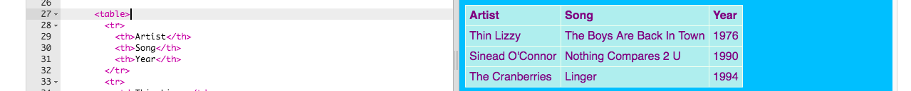

1. A veces puede ser útil mostrar información en una tabla. Por ejemplo, si deseas incluir información de miembros en un sitio web para un club o escuela deportiva local. O, en este ejemplo, canciones!
2. Una tabla es una cuadrícula compuesta de** filas** y** columnas**. La mayoría de las tablas también incluyen títulos en la parte superior de cada columna, llamada **encabezamiento**.
3. Ve al fichero page\_with\_table.html. Allí verás un montón de código entre tags `<table> </table>` . Selecciona todo el código desde el comienzo del tag `<table>`  hasta el final del tag de cierre `</table>` y **cópialo** .
4. Ve a uno de tus ficheros donde te gustaría poner un table y **pégalo** en el código.
5. Echemos un vistazo a todos esos tags. Es un poco como el código para una lista \(recuerdas`<ul>` y`<ol>`?\) pero con mas niveles.
   * Cada par de tags `<tr> </tr>` es una **fila**. Por tanto  todo lo que esté entre ellos se mostrará en una línea.
   * La primera fila contiene los tags `<th> </th>`. Estos se usan para los **encabezamientos**, o sea los títulos de las columnas van entre ellos. Hay un par por cada columna que tengas en tu table.
   * Los tags`<td> </td>` se usan para  los **datos de la tabla**, y eso es lo que va en todas las otras filas. Estos son como el elemento de la lista `<li> </li>`: todo lo que hay entre ellos es un elemento en la fila de tu tabla.
6. Aquí hay un ejemplo de una tabla llena con información
   ```
    <table>
      <tr>
        <th>Artist</th>
        <th>Song</th>
        <th>Year</th>
      </tr>
      <tr>
        <td>Thin Lizzy</td>
        <td>The Boys Are Back In Town</td>
        <td>1976</td>
      </tr>
      <tr>
        <td>Sinead O'Connor</td>
        <td>Nothing Compares 2 U</td>
        <td>1990</td>
      </tr>
      <tr>
        <td>The Cranberries</td>
        <td>Linger</td>
        <td>1994</td>
      </tr>
    </table>
   ```
7. Y aquí está como luce en el sitio web
8. ¡Prueba llenar tu table con lo que quieras! Simplemente coloca texto entre los tags`<td> </td>` y también entre los tags  `<th> </th>`. Puedes agregar más tags si lo necesitas.
9. Para agregar otra fila, agregue otro conjunto de tags `<tr> </tr>`.Entre ellos pon el mismo número de elementos de **data,** con tags `<td> </td>` como tienes en las otras filas.
10. Para adicionar otra **columna** adiciona un element de **data** extra con un conjunto de tags `<td> </td>` dentro de cada fila. Añade también a la primera fila un elemento de **encabezamiento **extra  , usando`<th> </th>` tags.
11. Si miras al final del fichero styles.css, verás el código CSS que describe cómo debe verse la tabla. ¡No tienes que entender todo! Pero puedes experimentar cambiando los colores del texto, el borde y el fondo para diseñar tu propio estilo.
    ```
    table, th, td {
      border: 1px solid HoneyDew;
      border-collapse: collapse;
    }
    tr {
      background-color: PaleTurquoise;
    }
    th, td {
      vertical-align: top;
      padding: 5px;
      text-align: left;
    }
    th {
      color: purple;
    }
    td {
      color: purple;
    }
    ```
12. Observas cómo algunos de los selectores usan **commas**, por ejemplo `table, th, td`? Esto es una _lista de selectores_: significa que se aplica a  _todos los elementos _`<th>`_  y \_a todos_  los elementos`<td>`. ¡Ahorra escribir el mismo conjunto de reglas para cada selector!


