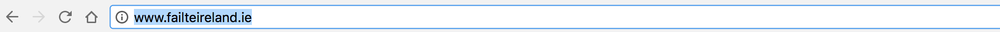
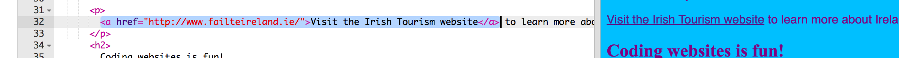

1. Para convertir un texto en un enlace, ponlo entre los tags `<a> </a>` . Se ve así: `<a href="attractions.html">Attractions</a>`
   * El atributo **href **le dice al navegador la dirección de la página a la que enlazará. Al igual que con todos los atributos, el valor que le des debe ir entre comillas.
2. Ve al fichero index.html y adiciona los tags a cada elemento en su lista de páginas, de manera que se vea así.  ¡Cambia el texto dentro de las comillas para que coincida exactamente con los nombres de los nuevos archivos que creaste! Adiciona un elemento de la lista con un enlace para la página de inicio también.
   ```
   <ul>
      <li><a href="index.html">Home</a></li>
      <li><a href="attractions.html">Attractions</a></li>
      <li><a href="music.html">Music</a></li>
      <li><a href="food.html">Food</a></li>
   </ul>
   ```
3. ¡Ahora puedes navegar a tus nuevas páginas! Haz clic en Guardar y luego en Ejecutar para ver tus enlaces y probarlos.
4. Los enlaces a otros sitios web lucen igual. Escribe el código para otro conjunto de tags de enlace en tu página, dejando el valor **href** en blanco por el momento. 
   ```
   <p>
      <a href="">Visit the Irish Tourism website</a> to learn more about Ireland!
   </p>
   ```
5. Go to a website that you want to link to. Click in the address bar and select all of the text. That's the whole address of the page you're on. Press the **Ctrl** \(or **cmd**\) and **C** keys together to **copy** it. 
6. Ahora regresa a tu código. Haz clic entre las comillas \(asegúrate de ver el cursor parpadeando allí\) y pega la dirección presionando Ctrl \(o cmd\) y V juntos. Haz clic en Ejecutar para probar el enlace!
7. Al igual que el otro texto, puedes hacer que los enlaces sean de cualquier color que desees en la hoja de estilo. Ve al fichero styles.css y añade el siguiente conjunto de reglas. Observa que el selector para los enlaces es `a`. Escoge cualquier que desees! Haz que sea un color diferente a los otros colores de texto que has usado. Para ver sus cambios, haz clic en Ejecutar.
   ```
   a {
      color: Brown;
   }
   ```


