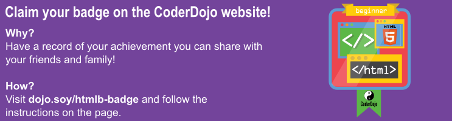

1. Vamos a descargar tu código y mirarlo! En la esquina superior izquierda del panel de códigos, haz clic en el ícono de menú que luce como tres líneas y haz clic en Download. 
2. Un fichero zip será descargado. Contiene todos los ficheros para tu sitio web. 
3. Abre el fichero zip y encuentra el fichero llamado index.html. Recuerda que este fichero es tu página de inicio. Haz doble clic en él para abrirlo en un navegador. ¡Haz clic en los enlaces y explora tu sitio web en todo su esplendor!
4. ¿Puedes ver el título de la página en la parte superior de la pestaña o ventana? Observa el título en cada página. Este es el texto que pusiste entre los tags `<title> </title>` .
5. Deja la ventana del navegador abierta y vuelve a la ventana con la lista de ficheros. Encuentra index.html nuevamente. Esta vez haz clic derecho\(para "clic derecho" en una Mac, lo mismo clic y sostener, o clic con dos dedos!\), selecciona "Open With &gt;" y escoge un editor de texto plano como Notepad, Notepad ++ o Sublime Text. Deberías ver todas las etiquetas HTML, como en el panel de código en Trinket.
   * Si estás usando una Mac, es posible que debas instalar primero un editor de texto plano
6. Como sabes, una página web está compuesta de texto, con tags para controlarla. Ahora puedes ver que la página web y el código son de hecho el mismo fichero: dependiendo de si lo abres en un **navegador **o un **editor de texto plano**, verás ya sea el **código **\(texto y tags\) o la **página web** \(solo texto\).
7. ¡Felicitaciones! ¿Por qué no compartir tu proyecto con otras personas para mostrarlo? Haz clic en el botón Compartir \(al lado del botón Guardar\) y selecciona una de las opciones.
   

