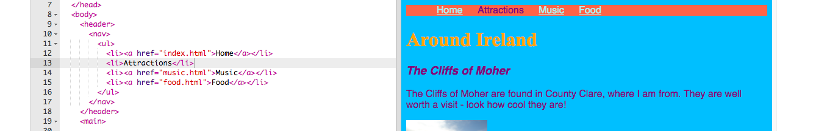

1. Al agregar más reglas de CSS en la hoja de estilos, puedes transformar tu menú de navegación en una barra de menús muy atractiva! 
2. Ve al fichero de la hoja de estilos. Recuerda está en el tab styles.css. Haz clic después de un cierre de llaves `}` y presiona enter para ir a una nueva línea. Adiciona la siguiente regla.
   ```
      nav ul {
         background-color: tomato;
      }
   ```
3. ¿Te das cuenta de cómo usaste **dos selectores **en lugar de uno? Si usaste el selector `ul` solo,  la regla afectaría todas las listas desordenadas en tu sitio web. Adicionando el selector`nav` así como se hizo, la regla solo se aplica a las listas que están entre los tags `nav`.
4. Haz clic en Ejecutar para ver cómo luce. 
5. Deshagámonos de las viñetas. Estos son los lugares al frente de cada elemento de la lista. Ve a la pestaña styles.css y adiciona lo siguiente al fichero. De nuevo, escríbelo en una nueva linea después de un `}` así no está accidentalmente dentro de ningún otro bloque de reglas.

   ```
   nav ul li {
      list-style-type: none;
   }
   ```

   ¡Observa que este conjunto de reglas tiene tres selectores! Selecciona todos los elementos `li` que están en una lista `ul`  la cual esta dentro de una sección `nav`. ¡Uf!

6. Ahora hagamos la lista horizontal \(a través\) en lugar de vertical \(abajo\). Dentro del nuevo conjunto de reglas, adiciona la siguiente línea: `display: inline;` Agreguemos también las propiedades `margin-right` y `margin-left` para espaciar los elementos del menú un poco. Las reglas deberían verse así ahora:

   ```
   nav ul li {
      list-style-type: none;
      display: inline;
      margin-right: 10px;
      margin-left: 10px;
   }
   ```

   Recuerda `10px` significa 10 **pixels**.

7. ¿Qué te parece cambiar el menú para indicarte en qué página estás? Esta parte no estará en la hoja de estilos.

8. Comencemos con la página de inicio. Ve al fichero index.html. En la lista, elimina los tags de enlace antes y después de la palabra "Home",de manera que el elemento de la lista para la página principal sea solo texto entre tags`<li> </li>` , como esto: `<li>Home</li>`.
9. Ahora ve a cada uno de tus otros ficheros, y haz lo mismo cada vez que quites los tags de enlace para la página que estás editando. Por lo tanto, en el fichero music.html, elimina los tags de enlace en el elemento de la lista "Music", y así sucesivamente. 
10. Haz clic en Ejecutar y explora tus páginas. Ves como la barra de menú muestra la página en la que estás como texto sin formato en vez de un enlace?


