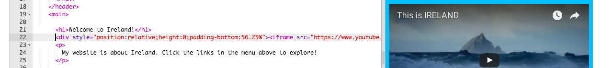

1. Bonus: ajoute une video! Youtube offre une façon facile d'**intégrer**(embed en anglais) des vidéos dans ton site web. Cherche une vidéo sur YouTube que tu voudrais ajouter à ton site.
2. Cherche le bouton "Partager" et click-le. Selectionne l'option "Intégrer". 
3. Tu verras un cadre contenant du texte selectionné. **Copie** ce texte en utilisant le raccourci que tu as appris (qui utilise la touche **C**). 
4. Retourne à ton code et click là où tu souhaites mettre ta vidéo, par exemple après un en-tête ou un paragraphe.  **Colle** le code en utilisant le raccourci que tu as appris (qui utilise la touche **V**). Ne 
t'inquiètes pas au sujet de ce que fait ce code pour l'instant! 
 * **Note:** Suivant la configuration de ton navigateur, les vidéos peuvent être bloquées. Demande à un mentor de t'aider pour ajuster les paramètres pour acceder au contenu de sites externes.
5. Click Run pour voir la vidéo s'afficher sur ta page web. 
6. La même technique fonctionne pour Google Maps. Essaie! Ouvre [dojo.soy/google-maps](http://dojo.soy/google-maps) et cherche pour un endroit que tu veux montrer sur ton site web. Click sur le résultat et cherc
he le bouton "Partager", click sur "Intégrer la carte" pour récuperer le code et ajoute-le à ton site web comme auparavant. 
 * **Note:** C'est une bonne idée de ne _pas_ inclure d'informations personnelles (comme l'adresse de ta maison) sur ton site web!
7. Si tu regardes attentivement, tu peux remarquer que le code que tu as collé contient les attributs `width` et `height`. Tu peux changer ces valeurs pour afficher ta carte plus grande, ou plus petite. 

