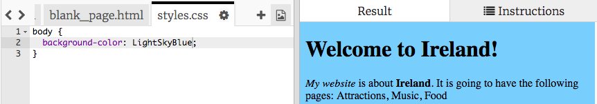

1. Dans ton Trinket, cherche l'onglet du côté du panneau de code et ouvre le fichier **styles.css** en cliquant sur l'onglet ayant ce nom. Si tu ne trouves pas **styles.css**, utilise les bsoutons **<** et **>** afin de trouver l'onglet.

   * Le **CSS** est le code qui définit l'apparence de ton site web.

2. Le fichier contient le texte suivant :

   ```css
   body {
       background-color: white;
   }
   ```

3. Les accolades `{ }` et le texte entre elles est un group de **règles CSS**. Le mot `body` signifie que les règles s'appliquent pour tous les élements `<body>` de ton site. On appelle la partie exterieure des accolades le sélecteur. Dans notre cas, le **sélecteur** est l'élement **body**.
4. Change la couleur en `LightSkyBlue` et click Run \(souviens-toi, il s'agit du bouton "Click to Run"\). Ton site web devrait désormais avoir un fond blue! 
5. Que se passe-t-il? Si tu regardes au début de ton fichier index.html, tu verras la ligne suivante:
   `<link type="text/css" rel="stylesheet" href="styles.css"/>` Cela indique à ton navigateur de regarder spécialement pour un fichier appelé styles.css. Ce fichier est une **feuille de style (stylesheet)**. Tu 
peux reconnaitre une feuille de style par le **.css** dans son nom. La feuille de style contient les règles définissant à quoi doivent ressembler chaque élement de ta page.
   * Chaque règle est composée de **propriétés** avec un caractère `:` après chacune d'entre-elles, puis d'une valeur pour la propriété, terminé par un caractère `;` \(**point-virgule**\)
6. Ajoutons des règles pour changer l'apparence du texte. Ajoute deux nouvelles lignes entre les accolades comme cela : 
   ```css
   body {
      background-color: LightSkyBlue;
      font-family: "Helvetica", sans-serif;
      color: purple;
   }
   ```
7. Click Run pour voir les changements sur ta page web. 
   * La propriété `couleur` est toujours associée au texte. 
8. Tu peux aussi ajouter des règles afin que les en-têtes soient différentes des paragraphes! Pour cela, utilise le sélecteur `h1`. Ajoute le code suivant à ton fichier styles.css après l'accolade fermante.
   ```css
   h1 {
      color: orange;
      font-family: "Times New Roman", serif;
   }
   ```
9. Click Run. Tes en-têtes devraient être orange désormais, et le texte violet comme auparavant. 
10. Tu as remarqué que les lettres sont aussi différentes en plus de la couleur? C'est parce que nous avons changé la **police de caractères (font-familly)**. Tu peux voir d'autres polices de caractères sur [dojo.soy/web-font-families](http://dojo.soy/web-font-families)
11. Essaye d'ajouter un nouveau groupe de règles pour les en-têtes `<h2>`, en utilisant le sélecteur `h2`.   
12. Pourquoi ne pas experimenter d'autres combinaisons de couleurs pour le texte et le fond ? Il existe de nombreuses couleurs prédéfinies disponibles. Pour une liste complète, visite [dojo.soy/web-color-names](http://dojo.soy/web-color-names)
