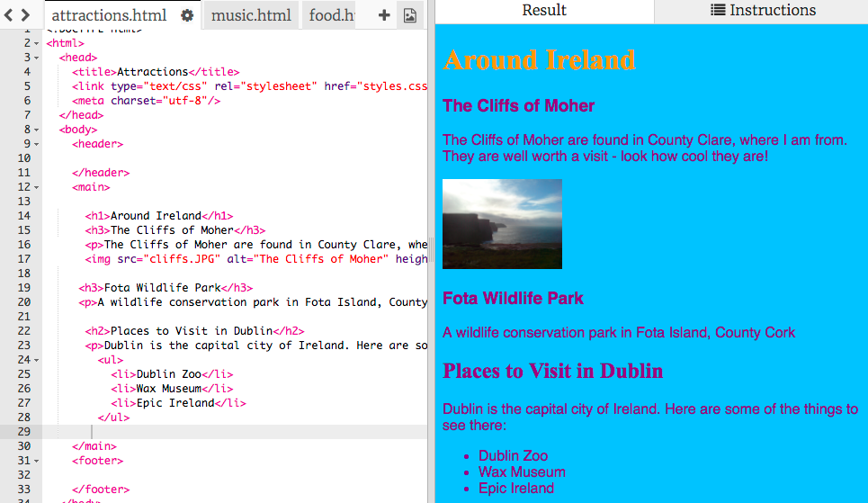

1. Maintenant que tu as decidé quelles pages tu voudrais avoir dans ton site web, il est temps de s'en occuper! Pour créer une nouvelle page web, créé un fichier avec un nom se terminant en **.html**. En haut du panneau de code, clcik sur le caractère **+** à coté des onglets. Cela créera un nouveau fichier. Donne-lui un nom. Souviens-toi qu'il doit finir en **.html** \(avec le point!\) afin que le navigateur puisse le reconnaitre en tant que page web.
   * Si tu veux changer le nom d'un fichier, click sur l'icone d'engrenage à droite du nom du fichier, et click sur le stylo. Tape le nouveau nom et presse la touche Entrer. Tu peux aussi supprimer un fichier en cliquant sur l'icone de poubelle à la place du stylo.
2. Tu dois te demander pourquoi tu ne peux pas changer le nom du fichier index.html. "index.html" est un nom spécial utilisé pour les **pages d'acceuil** des sites web. C'est la première page qui est chargée lor
sque tu visites un site web. Lorsque tu visites la page d'accueil d'un site web, le navigateur cherche le fichier appelé "index.html" et l'affiche sur ton écran.
3. Ouvre le fichier blank\_page.html dans le panneau de code \(en cliquant sur l'onglet qui a ce nom\). Selectionne tout le texte dans ce fichier en executant les étapes suivantes: Click n'importe où dans le pan
neau de code, puis presse la touche **Ctrl** et maintiens-la appuyée \(ou si tu utilises un mac, la touche **cmd**\) en pendant que tu la maintiens appuyée, appuye sur la touche **A** en même temps. tu peux voir que tout le texte est désormais surligné.
4. Maintenant, avec le texte selectionné, appuie et maintiens appuyé la touche **Ctrl** \( ou **cmd**\) et tout en maintenant cette touche appuyée, presse la touche **C**. Cela va **copier** tout le texte qui es
t selectionné.
5. Ouvre ton nouveau fichier et click dans le panneau de code \(qui est vide pour le moment\). Appuie et maintiens la touche **Ctrl** \(ou **cmd**\) et en la maintenant appuyée, presse la touche **V**. Cela va **coller** tout ce qui a été copié. 
 * Tu peux utiliser ces raccourcis dans la plupart des logiciels afin de **copier** et **coller** des choses, comme du texte ou des images!
6. Change le texte entre les balises `<title> </title>` afin que ta page ait un titre descriptif. 
7. Entre les balises `<main> </main>` du nouveau fichier, utilise les balises que tu as appris pour ajouter du contenu à ta page, comme des paragraphes, des en-têtes, des images ou des listes!
8. Répète toutes ces étapes pour chacune des nouvelles pages que tu souhaites créer.  
 * N'oublie pas, si tu as trop d'onglets pour toutes les voir, tu peux utiliser les icones **<** et **>** pour naviguer entre les onglets.

  
10. Sur la prochaine card, tu apprendras comment faire des **liens** afin que tu puisses acceder à ces nouvelles pages.   