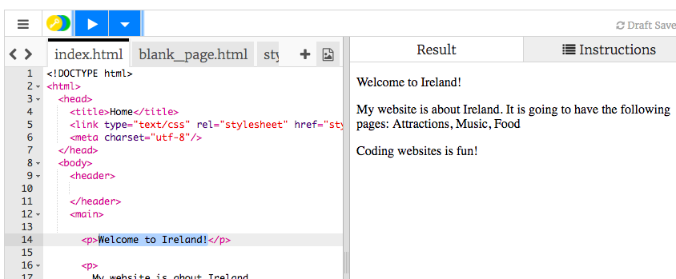

1. Dans le cadre de gauche, le **panneau de code**, click sur l'onglet nommé "index.html".
2. Trouve la ligne qui dit "Welcome to Ireland!" ("Bienvenue en Irlande!") et change la pour "France" ou ta ville. Fais attention à ne pas enlever le texte `<p>` au début de la ligne ainsi que `</p>` à la fin de la ligne. Click ensuite sur la boutton "Click to Run" ("Click pour lancer"). Il s'agit du bouton pour Lancer. Tu verras la page web se mettre à jour dans le cadre de droite. 
3. Sur la même ligne, change le `<p>` et `</p>` en `<h1>` et `</h1>`, puis click "Run" ("Lancer"). Que se passe-t-il?
  ```html
    <h1>Bienvenue en France!</h1>
  ```
4. Lorsque tu mets du texte dans une page web, il te faut l'encadrer entre deux **balises**, indiquant au navigateur comment afficher le texte. Par exemple, la balise `<p>` informe le navigateur qu'il s'agit d'un paragraphe. La balise `<h1>` dit au navigateur qu'il sagit d'une en-tête. 
   * Un navigateur est un logiciel que tu utilises pour voir les sites webs, par exemple Firefox ou Chrome. 
   * Le **.html** dans le nom du fichier indique au navigateur qu'il sagit d'une page web. Le navigateur cherche alors les balises au sein du fichier pour savoir quoi afficher. **HTML** est le code permettant de créer une page web.   
5. Pourquoi faut-il deux balises? Tu as besoin d'une balise **ouvrante** et une **fermante** afin d'informer le navigateur où les choses commencent et se terminent. Pour un paragraphe, la balise ouvrante `<p>` dit "je veux que le texte suivant soit formatté comme un paragraphe". La balise fermante `</p>` dit au navigateur où le paragraphe se termine. Tout ce qui est entre la balise `<body>` et `</body>` est ta page web. 
   * Remarque comment que la balise **fermante** contient toujours un slash `/`. 
   * Les balises définissent différentes parties d'une page, comme les paragraphes, les en-têtes ou le corps (`body` signifie corps en anglais); ces morceaux sont appelés **élements**. Pense à cela comme étant des briques.  

6. Essaie le `p` en `h2` dans le dernier paragraphe, celui où est écrit "Coding websites is fun!" ("Coder un site web est fun!"). N'oublie pas de changer à la fois la balise ouvrante `<p>` et celle fermante `</p>`. 
7. Trouve la balise `<title>` ("titre") et `</title>` et change le texte entre les deux en "Accueil". Puis click le bouton "Run". 
 * Le titre est le texte que tu peux normalement voir dans l'onglet ou en haut du navigateur. Trinket ne le montre pas mais tu le verras lorsque tu téléchargeras ton code plus tard.
8. Trouve le code dans le paragraphe dans lequel est écrit "My website is about Ireland" ("Mon site web est au sujet de l'Irlande") et change-le afin que ça ressemble à ça :
   ```html
      <p>
         <em>Mon site web</em> est au sujet de la <strong>France</strong>. 
         Il aura les pages suivantes: Attractions, Musique, Cuisine
      </p>
  ```
  * Comprends-tu à quoi servent les balises `<em> </em>` et `<strong> </strong>`? Note: "em" est un raccourci pour "emphase".
8. Click sur le bouton bleu "Save" ("Sauvegarder") en haut à droite pour enregistrer tes modifications. 
9. Au final, une page web est simplement composée de texte, avec des balises pour le contrôler. 
 * Tu as `p` pour les paragraphes, et `h` pour les en-têtes. Essaie d'ajouter plus d'en-têtes en changeant le numéro dans la balise pour voir les différentes tailles d'en-tête disponibles! Elles vont de `<h1>` jusqu'à `<h6>`. Ajoute plus de paragraphes avec de nouvelles balises `<p>` si tu as envie !
