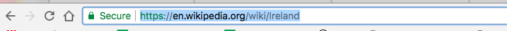

1. Pour transformer du texte en lien, ajoute les balises `<a> </a>` autour du texte. Ca devrait ressembler à cela :  
   ```html
      <a href="attractions.html">Attractions</a>
   ```
 * L'attribut **href** indique au navigateur l'adresse de la page web vers laquelle aller. Comme tout autre attribut, la valeur doit être mise au sein des guillemets.
2. Ouvre le fichier index.html et ajoute les balises pour chacun des élements de ta liste de pages. Change le texte au sein des guillemets afin qu'il corresponde au nom exact des fichiers que tu as créé! Ajoute 
aussi une liste de liens pour la page d'accueil.
   ```html
   <ul>
      <li><a href="index.html">Accueil</a></li>
      <li><a href="attractions.html">Attractions</a></li>
      <li><a href="musique.html">Musique</a></li>
      <li><a href="cuisine.html">Cuisine</a></li>
   </ul>
   ```
3. Tu peux désormais naviguer entre tes pages web! Click Save puis click Run pour voir tes liens et les essayer.
4. Les liens vers d'autres sites web sont similaires. Ajoute du code pour un autre groupe de liens dans ta page web, et laisse l'attribute **href** vide pour l'instant.
   ```html
   <p>
      <a href="">Visite la page Wikipedia</a> pour en savoir plus au sujet de la France! 
   </p>
   ```
5. Visite un site web auquel tu aimes. Click dans la barre d'adresse et selectionne tout le texte. Il s'agit de l'adresse de la page sur laquelle tu es. Appuie sur les touches **Ctrl** \(ou **cmd**\) et **C** en même temps pour copier l'adresse. 

 * **Note:** Dans Trinket, seuls les liens commençant par **https://** fonctionneront. Si ton lien commence avec **http://**, il ne fonctionnera pas dans Trinket, mais seulement lorsque tu téléchargeras ton proj
et et le lanceras depuis les fichiers dans ton navigateur. (le **s** signifie **sécurisé**).

6. Retourne désormais à ton code. Click entre les guillemets \(vérifie que le curseur clignote entre les guillemets\) et **colle** l'adresse en appuyant sur **Ctrl** \(ou **cmd**\) et **V**. Click Run pour essayer ton nouveau lien! 
7. Comme pour le texte, tu peux faire que tes liens soient de la couleur de ton choix dans ta feuille de style. Ouvre ton fichier styles.css et ajoute le groupe de règles suivant. Tu peux voir que le sélecteur pour les liens est `a`. Choisis la couleur que tu veux! Prefère une couleur différente du texte de tes paragraphes. Pour voir tes changements, click Run.
   ```css
   a {
      color: Brown;
   }
   ```