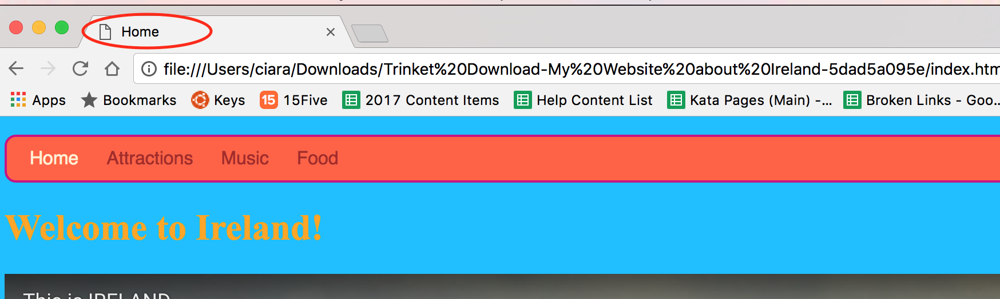

1. Téléchargeons ton code et jettons-y un oeil! Dans le coin en haut à gauche de ton panneau de code, click sur l'icone du menu ressemblant à trois lignes et click Download("Télécharger"). 

2. Un fichier zip sera téléchargé. Il contient tous les fichiers de ton site web. Extrais tous les fichiers de ton site web sur ton ordinateur.
3. Ouvre le dossier extrait et cherche le fichier appelé index.html. Rappelle-toi qu'il s'agit de ta page d'accueil. Double click dessus pour l'ouvrir dans ton **navigateur**. Click les liens et explore ton site
 dans toute sa splendeur! 
4. Tu peux voir le titre de ta page en haut de l'onglet ou de la fenêtre? Que vois-tu dans le titre de chaque page? Il s'agit du texte que tu as mis entre les balises `<title> </title>`.
5. Laisse la fenêtre du navigateur ouverte et retourne à la fenêtre contenant la liste de fichiers. Cherche à nouveau index.html. Cette fois, click-droit \( pour click-droit sur Mac, soit click et maintiens cliq
ué ou click avec deux doigts!\), sélectionne "Ouvre Avec &gt;" et choisis un éditeur de texte comme Notepad, Notepad++ ou Sublime Text. Tu devrais voir toutes les balises HTML, comme dans le code sur Trinket.
 * Si tu es sur Mac, il te faudra peut-être installer un éditeur de texte. 
6. Comme tu le sais, une page web est simplement faites de texte, avec des balises pour le controler. Maintenant tu peux voir qu'une page web et le code sont effectivement le même fichier: en fonction de quel logiciel tu utilises, tu verras le **code** \(texte et balises\) dans un **éditeur de texte** ou bien la **page web** \(texte, image et styles\) dans le **navigateur**.
7. Félicitations! Pourquoi ne pas partager ton projet avec d'autres personnes? Dans Trinket, click le bouton "Share" ("Partager") (à coté du bouton Save) et sélectionne une des options.
 

