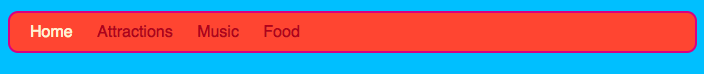
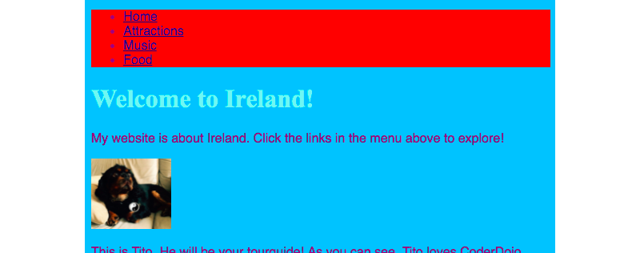
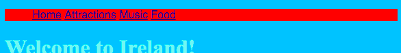
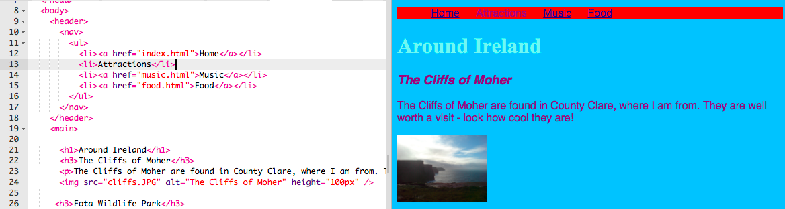

1. En ajoutant plus de règles **CSS** à la feuille de style, tu peux transformer ton menu de navigation en une barre de menu super sympa! 
2. Ouvre le fichier de feuille de style. Souviens-toi, il s'agit de l'onglet styles.css. Click _après_ l'accolade fermante `}` et appuie sur la touche Entrer pour aller sur une nouvelle ligne. Ajoute la règle su
ivante.    
   ```css
      nav ul {
         background-color: tomato;
      }
   ```
3. Tu remarqueras que nous avons utilisé **deux selecteurs** au lieu d'un seul. Si tu utilises seulement `ul`, la règle s'appliquera à _toutes_ les listes non-numérotées de ton site web. Ajouter le selecteur `nav` restreint la règle aux listes qui sont au sein d'une balise `nav`.
4. Click Run pour voir à quoi ça ressemble! 
5. Enlevons les puces. Ce sont les ronds au début de chaque élements de liste. Ouvre l'onglet styles.css et ajoute le code suivant au fichier. Comme auparavant, ajoute-le sur une nouvelle ligne après une accolad
e fermante `}` afin que ça ne soit pas au sein d'un autre groupe de règles.
   ```css
   nav ul li {
      list-style-type: none;
   }
   ```
Tu remarqueras que ce jeu de règles a _trois_ selecteurs! Il selectionne tous les élements `li` qui sont dans un élement `ul` qui sont au sein d'un élement `nav`. Phew!
6. Changeons la liste afin de la rendre horizontale(en ligne plate) au lieu de verticale (descendante). Dans le nouveau jeu de règles, ajoute la ligne suivante: `display: inline;` 
 
 Les élements du menu sont tous regroupés, séparons-les grâce aux propriétés `margin-right` et `margin-left`. Les règles devraient ressembler à ça :  
   ```css
   nav ul li {
      list-style-type: none;
      display: inline;
      margin-right: 10px;
      margin-left: 10px;
   }
   ```
   Souviens-toi que `10px` signifie 10 **pixels** qui sont une unité de mesure.
7. Et si on changeait le menu afin d'indiquer sur quelle page on est? Cela ne se fera pas dans la feuille de style.
8. Commençons pour la page d'accueil. Ouvre la page index.html. Dans la liste, enlève les balises de liens avant et après le mot "Accueil", afin que l'élement de liste pour la page d'accueil ne soit qu'entre des balises `<li> </li>`, comme ça `<li>Accueil</li>`.
9. Ouvre les autres fichiers et fais la même chose. A chaque fois, enlève les balises de lien autour du nom de la page que tu es en train de modifier. Ainsi, sur la page musique.html, enlève la balise de lien dans l'élement de liste "Musique".
 
 Click Run et explore tes pages. Tu dois pouvoir identifier dans ton menu sur quelle page tu es déjà, le lien étant désormais du texte au lieu d'un lien. 
