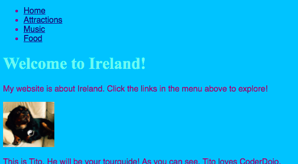
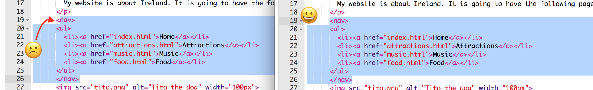

1. Beaucoup de sites web ont un menu de **navigation** afin d'aider les utilisateurs à utiliser le site web. Maintenant que tu as un groupe de pages, une page d'accueil, et des liens pour naviguer, nous allong b
ouger tous ces liens au début de la page. 

2. Juste avant d'ouvrir la balise `<ul>`, appuie sur la touche Entrer pour créer une nouvelle ligne. Puis, sur la nouvelle ligne, tape la balise suivante : `nav`. Trinket ajoute automatiquement la balise fermante pour toi, que tu peux enlever pour l'instant.  
3. Juste _après_ la balise _fermante_ `</ul>`, appuie sur Entrer pour aller à la ligne suivante et tape la balise fermante `</nav>`.
   * "nav" signifie **navigation**. La section `nav` est un groupement d'outils pour naviguer au sein du site web.
   
4. Selectionne toute la section `nav` en cliquant juste avant la balise ouvrante `<nav>` et glisse jusqu'à la balise fermante `</nav>`, afin que tout le texte, balises ouvrantes et fermantes comprises, soient surlignées. Vérifie que tous les chevrons `<` et `>` au début et à la fin sont aussi surlignés!  
5. Tu vas désormais **couper** au lieu de **copier**. Appuie et maintiens la touche **Ctrl** \(ou **cmd**\) puis presse la touche **X**. Le code va disparaitre, mais pas de panique!
6. Au début de ton fichier, click dans l'espace entre les balises `<header> </header>`. Verifie que le curseur clignote au bon endroit. Puis **colle** le code en appuyant sur **Ctrl** \(ou **cmd**\) et **V** comme d'habitude. Click Run pour voir tes changements! Le code devrait ressembler à cela désormais :
   ```html
   <header>
      <nav>
         <ul>
            <li><a href="index.html">Accueil</a></li>
            <li><a href="attractions.html">Attractions</a></li>
            <li><a href="musique.html">Musique</a></li>
            <li><a href="cuisine.html">Cuisine</a></li>
         </ul>
      </nav>
   </header>
   ```

   * Si tu fais une erreur, tu peux revenir en arrière en appuyant sur **Ctrl** \(ou **cmd** \) et **Z**. Tu devrais pouvoir le faire suffisamment de fois pour revenir à un moment qui te plait. Il s'agit d'un autre raccourci que tu peux utiliser dans beaucoup d'autres logiciels!
7. Pour faire apparaitre le menu en haut de chaque page, mets le même code and chaque nouveau fichier que tu as créé. Selectionne toute la section `nav` comme auparavant et appuie sur les touches **Ctrl** \(ou **cmd**\) et **C** ensemble pour **copier**.  Ensuite, dans chacun des autres fichiers, click à l'interieur de la section `<header> </header>` et **colle** le code exactement comme tu l'as fait à l'étape 6.
9. Quand tu cliqueras sur Run, tu pourras clicker les liens quelque soit la page sur laquelle tu es. N'oublie pas de cliquer sur Save pour sauvegarder tout ce que tu as fait!

