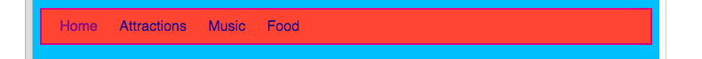

1. Grâce au CSS, les possibilitées pour rendre ta barre de menu superbe sont infini. Ouvre une nouvelle fois le fichier styles.css \(Là où la magie se passe! \). Chaque fois que tu fais un changement, click Run 
pour voir à quoi cela ressemble. 
2. Trouve ton selecteur `nav ul` et ajoute plus de règles afin qu'il ressemble à cela:  
   ```css
      nav ul {
        background-color: tomato;
        border-style: solid;
        border-color: MediumVioletRed;
        border-width: 2px;
        padding: 10px;
      }
   ```
La propriété `padding` ajoute de l'espace. Es-tu capable de comprendre à quoi servent les autres propriétés? Experimente en changeant les différents nombres & couleurs des valeurs de propriétés. 
3. Pour se débarasser du soulignement des liens, ajoute le code suivant sur une nouvelle ligne après une accolade fermante `}` pour les règles `nav ul li`.
 * Tu peux les mettre après n'importe quel `}` mais c'est une bonne idée que de garder grouper tout ce qui sert à la même chose (par exemple le menu) afin que ça soit plus simple à retrouver.
   ```css
      nav ul li a {
         text-decoration: none;
      }
   ```
Cette règle s'applique à tous les _liens_ \(balises `<a>`\) à l'interieur des _élements de listes_ dans les _listes non-numériques_  au sein d'une section de _navigation_ \(`nav`\). Wow! Ca fait _quatre selecteu
rs_! 
3. Te souviens-tu comment tu avais enlevé la balise lien de certains élements de liste, de manière à identifier plus facilement sur quel page tu étais? Pourquoi ne pas aussi changer la couleur de ces élements de
 menu qui ne sont pas des liens? Trouve ton sélecteur `nav ul li` et ajoute la ligne                                                  
   ```css
      color: PapayaWhip;
   ```
   à l'interieur des accolades. Choisis la couleur que tu veux ! 
 * Tu peux aussi ajouter une propriété `color` aux règles `nav ul li a` si tu veux que les liens de tes menus soient d'une autre couleur que les autres liens dans ton site web.
4. Pourquoi pas des coins arroundis? Essaie d'ajouter la règle suivante aux règles `nav ul` pour voir ce qu'il se passe : `border-radius: 10px;`
 * La propriété `border-radius` est une façon vraiment facile de rendre ton site web plus cool! Pour ajouter un peu de difficulté, ajouter un nouveau jeu de règles dans ta feuille de style pour les images, utili
sant le sélecteur `img` et utilise la règle `border-radius`.   
5. Voilà à quoi ta feuille de style et ton site web devrait ressembler après tout cela.                                                                                                                       