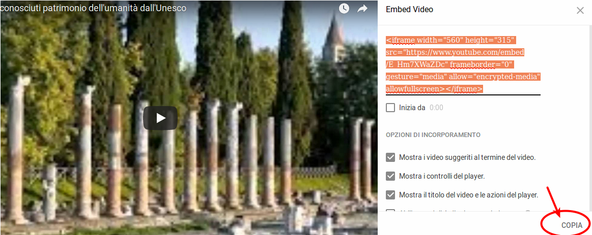
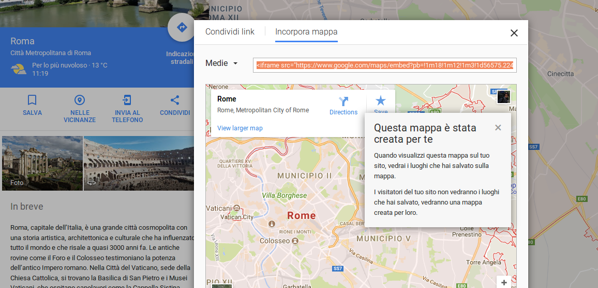
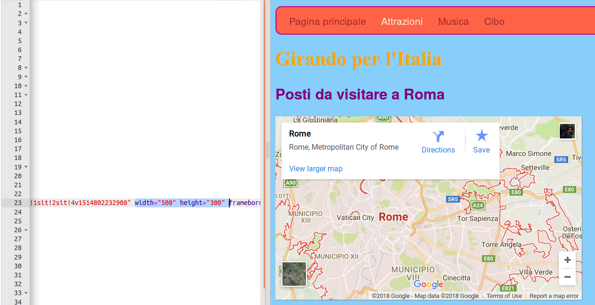

1. Bonus: aggiungi un video! YouTube fornisce un modo facile per **inserire** (_embed_) i suoi video dentro altri siti web. Cerca su Youtube un video che vuoi inserire nel tuo sito. 
2. Cerca il pulsante "Condividi" (_Share_) e cliccalo. Seleziona l'opzione "Incorpora" (_embed_).
3. Vedrai un riquadro con del testo selezionato (se per errore lo deselezioni, puoi selezionarlo di nuovo cliccando su di esso). Premi sul pulsante "Copia" per copiare il testo.
4. Vai quindi sulla home page del tuo sito e clicca su un punto dove vuoi inserire il video, per esempio dopo un titolo o un paragrafo. Incolla il codice premendo come al solito contemporaneamente **Ctrl** \(o **cmd**\) e **V**. 
 * **Note:** Depending on your browser's settings the video might be blocked. Ask a mentor to help you adjust the settings to enable content from external sites (sometimes called "unsafe content") to be shown.
5. Click Run to see the video appear on your web page.
6. The same technique works for Google maps as well. Give it a go! Go to [dojo.soy/google-maps](http://dojo.soy/google-maps) and search for a place you want to show on your website. Click on the result, then find the Share button, click "Embed map" to get the code and add it to your website as above. 
 * **Note:** It's a good idea _not_ to put personal information like your home address on a website!
7. If you look carefully you should be able to find `width` and `height` attributes in the pasted code. You can change the values to make the map appear bigger or smaller.

