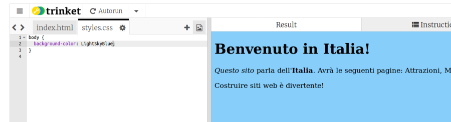

1. Su Trinket, cerca tra le linguette del pannello del codice il file **styles.css** ; clicca sulla linguetta per vedere e modificare il contenuto. Se non riesci a vedere la linguetta di **styles.css**, clicca sulle icone **&lt;** e **&gt;** per muoversi tra le linguette finché non la trovi.

   * **CSS** è il codice che contiene le regole che determinano come apparirà il sito web.

2. Il contenuto iniziale del file è:

   ```css
   body {
       background-color: white;
   }
   ```

3. Le parentesi graffe `{ }` e il testo racchiuso al loro interno, sono un insieme di **regole CSS**. La parola `body` indica che le regole si applicano a tutti gli elementi all'interno della sezione  `<body>` del sito. Il testo fuori dalle parentesi graffe viene detto **selettore**. In questo caso è il **selettore** per gli elementi del **body** della pagina.

4. Prova a cambiare il colore in `LightSkyBlue`, e osserva come cambia la pagina. Il tuo sito dovrebbe ora apparire su una pagina di colore blu chiaro \(se la pagina non cambia premere "Click to Run"\).
5. Cosa sta succedendo? Torniamo al file index.html: se osserviamo la parte iniziale del file vedremo la seguente riga:
   `<link type="text/css" rel="stylesheet" href="styles.css"/>` Questa riga dice al browser di cercare un "**foglio di stile**" \(stylesheet\) di nome styles.css. I fogli di stile si riconoscono perché il loro nome termina in **.css**. Il foglio di stile contiene delle regole che descrivono l'aspetto che devono avere i vari elementi che compongono la pagina web.
   * Ogni regola è costituita da una parte sinistra \(la **proprietà**\) con il simbolo `:` \(**duepunti**\) a seguire e da una parte destra con il **valore** per la proprietà e il carattere `;` symbol \(**punto e virgola**\) a chiudere.
6. Prova ad aggiungere delle regole per modificare il modo in cui viene visualizzato il testo. Aggiungiamo due nuove linee all'interno delle parentesi graffe:
   ```css
   body {
      background-color: LightSkyBlue;
      font-family: "Helvetica", sans-serif;
      color: purple;
   }
   ```
7. Osserva come cambia la pagina. 
   * La proprietà `color` si riferisce sempre al testo, che in questo caso viene visualizzato di colore porpora.
8. Proviamo adesso ad aggiungere una regola specifica per i titoli, in modo che appaiano differenti dal paragrafi. Per farlo usiamo il selettore `h1`. Aggiungiamo quindi il seguente codice al file style.css:
   ```css
   h1 {
      color: orange;
      font-family: "Times New Roman", serif;
   }
   ```
9. I titoli a questo punto dovrebbero apparire di colore arancione, mentre i paragrafi non cambieranno. 
10. Anche i caratteri appariranno diversi. Questo perché con la seconda regola abbiamo specificato un font specifico per i titoli. Puoi vedere altri font sl seguente link: [dojo.soy/font-families](http://dojo.soy/web-font-families)
11. Prova ad agguingere un blocco di regole per i titoli di tipo `<h2>`, usando il selettore `h2`.   
12. Prova a sperimentare combinazioni diverse per i colori del testo e dello sfondo. Ci sono moltissimi colori disponibili, per una lista completa vedere: [dojo.soy/web-color-names](http://dojo.soy/web-color-names)


