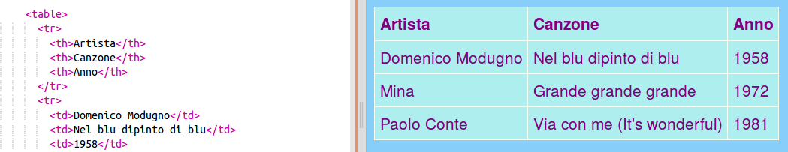

1. In alcuni casi può essere utile mostrare informazioni utilizzando una tabella, per esempio se si vogliono mostrare su un sito informazioni sui membri partecipanti a un club di sport o iscritti a uno scuola. O, come vedremo in questo esempio, per elencare canzoni! Una tabella è una griglia formata da **righe** and **colonne**. Molte tabelle inoltre includono dei titoli nella prima riga; questa prima riga viene chiamata **intestazione** (_header_).
2. Apri il file pagina\_con\_tabella.html. Vedrai che c'è del codice all'interno dei tag `<table> </table>`. Seleziona tutto il codice dall'inizio del tag di apertura `<table>` fino alla fine del tag di chiusura `</table>` e **copialo**. Vai quindi su uno dei tuoi file trova un posto dove inserire la tabella e **incolla** il codice.

3. Per il momento la tabella è vuota. Ecco un esempio di come potrebbe essere riempita:
  ```html
    <table>
      <tr>
        <th>Artista</th>
        <th>Canzone</th>
        <th>Anno</th>
      </tr>
      <tr>
        <td>Domenico Modugno</td>
        <td>Nel blu dipinto di blu</td>
        <td>1958</td>
      </tr>
      <tr>
        <td>Mina</td>
        <td>Grande grande grande</td>
        <td>1972</td>
      </tr>
      <tr>
        <td>Paolo Conte</td>
        <td>Via con me (It's wonderful)</td>
        <td>1981</td>
      </tr>
    </table>
  ```
4. Ed ecco come apparirebbe nel sito web: 
5. Guardiamo adesso più da vicino questo nuovo codice. Somiglia a quello delle liste \(ricordi `<ul>` e `<ol>`?\) ma con più livelli.
 * Ogni coppia dei tag `<tr> </tr>` è una **riga** ("tr" = _table row_). Tutto quello contenuto al suo interno viene visualizzato in una linea.
 * La prima riga contiene tag `<th> </th>` ("th" = _table heading_). Questi sono utilizzati per le **intestazioni**, i titoli delle varie colonne. C'è una coppia di questi tag per ogni colonna della tabella.
 * I tag `<td> </td>` contengono i dati veri e propri ("td" = _table data_); qui c'è quello che va su tutte le altre righe della tabella. Queste sono come gli elementi delle liste creati con i tag `<li> </li>` tags in a list: tutto quello contenuto al loro interno è un elemento di una riga della tabella.
6. Prova a riempire la tabella con quello che ti piace!! Inserisci semplicemente il testo tra i tag `<td> </td>` aggiornando coerentemente il contenuto dei tag `<th> </th>`. Puoi aggiungere altri tag se ti serve.
 
  Per aggiungere un'altra **riga**, Inserisci un altro blocco `<tr> </tr>`. All'interno di questo blocco inserisci lo stesso numero di elementi **dato** delle altre righe. Per fare questo utilizza i tag `<td> </td>`.
 
  Per aggiungere un'altra colonna **column** aggiungi un'altro elemento **dati** con una coppia `<td> </td>` in ogni riga. Ti servirà anche un elemento **intestazione** addizionale nella prima riga. Per aggiungerlo utilizza i tag `<th> </th>`.
7. Se guardi alla fine del file styles.css, troveria il codice CSS che descrive come deve apparire la tabella. Non serve capirlo tutto adesso, ma puoi provare a modificarlo inventandoti un tuo stile e cambiando il modo in cui appare il testo, i bordi, e il colore di sfondo.
  ```css
    table, th, td {
      border: 1px solid HoneyDew;
      border-collapse: collapse;
    }
    tr {
      background-color: PaleTurquoise;
    }
    th, td {
      vertical-align: top;
      padding: 5px;
      text-align: left;
    }
    th {
      color: purple;
    }
    td {
      color: purple;
    }
  ```
  Nota come alcuni dei seletturi usano la **virgola**. Per esempio `table, th, td`. Questa è una _lista di selettori_: significa che si applica a _tutti_ gli elementi `<th>` e `<td>` di tutte le tabelle, permettendo di evitare di scrivere le stesse regole più volte!
  