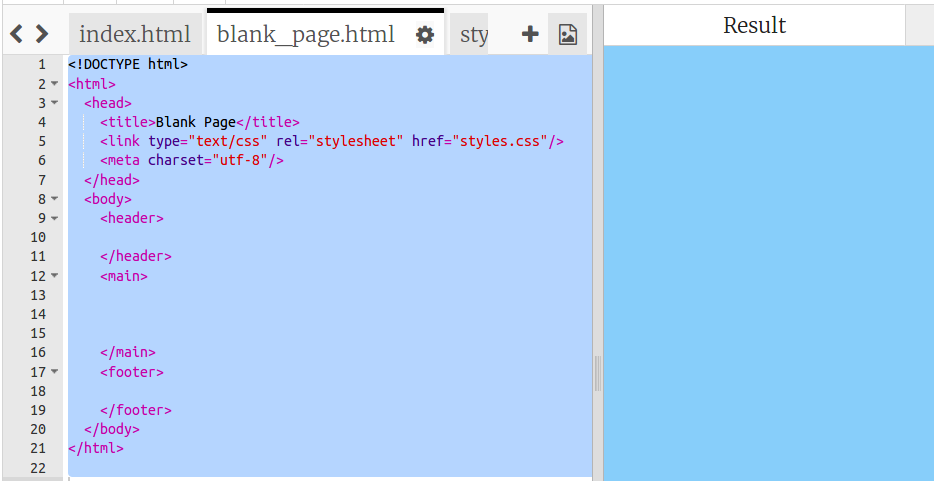
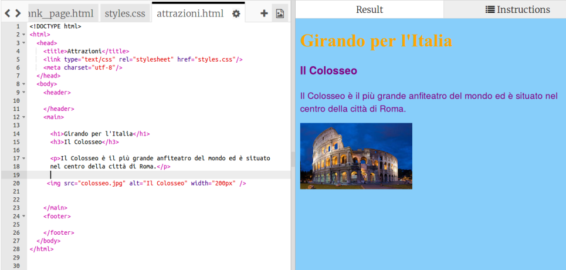

1. Visto che abbiamo deciso le pagine da cui sarà costituito il nostro sito, adesso proviamo a scriverle! Per creare un nuovo file clicchiamo sull'icona **+** che si trova immediatamente a destra delle linguette dei file nell'area del codice. Creiamo un nuovo file con il nome che termina con **.html** \(compreso il punto!\). In questo modo il browser capirà che il file contiene una pagina web.
   * If you want to change the name of a file, click on the cog icon to the right of the filename, and click the pencil. Type in the new name and press Enter. You can also delete a file by clicking the bin icon instead of the pencil.
2. You might be wondering why you can't change the name of the index.html file. "index.html" is a special name used for the **homepage** of a website. That's the first page you land on when you visit a website. When you go to a website's homepage, the browser looks for the file called "index.html" and displays it on your screen.
3. Go the the file blank\_page.html in the code panel \(by clicking on the tab with that name\). Select all of the text in the file by doing the following: Click anywhere inside the code panel, then press and hold the **Ctrl** key \(or if you are using a Mac, the **cmd** key\) and while holding it, press the **A** key at the same time. Notice how all the text becomes highlighted.
4. Now, with the text selected, press and hold the **Ctrl** \(or **cmd**\) key again and then while holding it press the **C** key. This **copies** everything that was selected.
5. Go to your new file and click inside the code panel \(which is blank at the moment\). Press and hold the **Ctrl** \(or **cmd**\) key and then while holding it, press the **V** key. This **pastes** everything that was copied into your new page.
 * You can use these keyboard shortcuts in most programs to **copy** and **paste** stuff, including text and files!
6. Change the text in between the `<title> </title>` tags so your new page has a descriptive title.
7. In between the `<main> </main>` tags in the new file, use the tags you have learned to add stuff to the page, such as paragraphs, headings, images and lists!
8. Repeat the steps above for each new page that you want to add. 
 * Remember, when there are too many tabs to be able to see them all, you can use the **<** and **>** icons in the top left corner of the tabs to scroll between them.

  
10. On the next card you're going to learn how to make **links** so that you have a way to get to the new pages.

