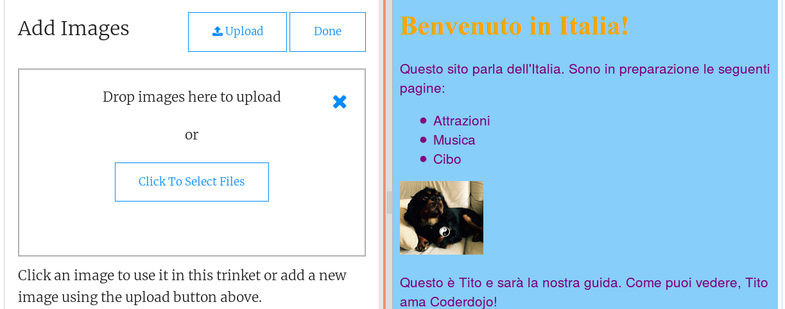

1. Clicca sull'icona con l'immagine accanto al simbolo **+**. Da qui è possibile vedere le immagini che possono essere utilizzate per il nostro sito ed eventualmente aggiungerne altre. Per il momento utilizziamo l'immagine presente all'interno del progetto. 
2. Selezionamo il file index.html nel pannello del codice, e inseriamo il seguente testo dopo il tag `</ul>`: 
   ```html
      
      <p>Questo è Tito e sarà la nostra guida. Come puoi vedere, Tito ama Coderdojo!</p>
   ```
   
 Nota cdhe il tag `` è diverso dagli altri visti finora: 
   * Non c'è un tag di chiusura `</img>`. Invece il tag è di tipo **"autochiudente"**: il tag di apertura ha i caratteri `/>` alla fine. Questo avviene perché non c'è un "inizio" e una "fine" come nel caso in cui si stia inserendo del testo in una pagina. 
   * The tag contains three extra pieces of information inside it called **attributes**. The `src` attribute tells the browser what file to use for the picture. The `alt` attribute is a short description that the browser will show if it cannot display the picture. 
4. What do you think the `width` attribute does? \(Hint: **px** is short for **pixels**, the teeny-tiny dots that make up your screen\) Try experimenting with different numbers! Don't delete the letters `px`. 
5. To add a picture of your own to the website, click on the image icon again, and click "Add Image". Click "Upload" and then select "Click To Select Files". Select the file on your computer that you want to upload and click "Open". Click "Done" when you are finished uploading files, and then click Save to save your work.

  **Note:** Check the name of your file before uploading it and **rename** it first if you need to. It's a good idea to have filenames that don't contain any spaces. Plus if you've downloaded a picture from the internet, it may be called something like "177823k-iewnf8832n2-3dkewnfwe512.png" which is not very easy to type!
 
6. Once you have uploaded a picture you can add it to your website using the `` tag as before. Change the value of the `src` attribute so that it exactly matches the name of the file with your picture. Change the value of the `alt` attribute to a short description of the picture. _Important:_ Attribute values like the filename and the alt text must be inside quotation marks!


