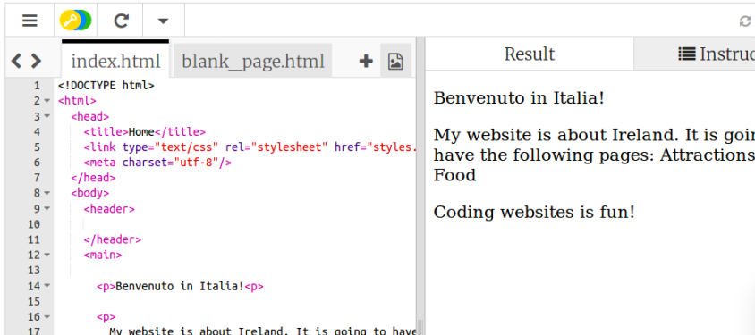

1. Nel pannello di sinistra, il **pannello del codice**, clicca sulla linguetta dove è scritto "index.html".
2. Trova la linea dove è scritto "Welcome to Ireland!" e modificala in modo che contenga il nome della tua nazione o città. Per esempio scrivi "Benvenuti in Italia"; fai attenzione a non cancellare i caratteri `<p>` all'inizio della linea e i caratteri `</p>` alla fine. Se è selezionata la modalità "Autorun", il pannello di destra si aggiornerà automaticamente, altrimenti clicca sul pulsante "Click To Run". Il pannello di destra \(la pagina web\) si aaggiornerà. 
3. Adesso, nella stessa linea, cambia i caratteri `<p>` e `</p>` in `<h1>` e `</h1>`. Cosa succede?
   ```html
    <h1>Benvenuto in Italia!</h1>
   ```
4. When you want to put text on a page, you need to put it in between two **tags** that tell your browser how to display your text. For example, the `<p>` tag tells the browser it is a paragraph of text. The `<h1>` tag tells it that the text is a heading.
   * A **browser** is the program you use to look at websites, for example Chrome or Firefox.
   * The **.html** in the filename tells the browser that the file is a web page, so it looks for the tags telling it what to display. **HTML** is the code that makes a web page.
5. Why do you need two tags? You have an **opening** and a **closing** tag to tell the browser where things start and end. So for a paragraph, the opening `<p>` tag says "here comes some text that I want you to display as a paragraph". The closing `</p>` tag tells the browser where the paragraph ends. Everything in between the `<body>` and `</body>` tags is your web page.

   * Notice how the** closing **tag always has a forward slash, `/`.
   * The tags define different pieces of a page, for example paragraphs and headings, or the body; these pieces are all called **elements**. Think of them as building blocks.

6. Try changing the `p` to `h2` in the last paragraph, the one that says "Coding websites is fun!" Remember to change it in both the **opening** `<p>` and the **closing** `</p>` tag.

7. Find the `<title>` and `</title>` tags and change the text in between them to "Home". Then click the run button. 
   * The title is that text that you normally see on the tab or at the top of your browser window. Trinket won't display it but when you download your code later you will see it.
8. Find the code for the paragraph that says "My website is about Ireland" and change it so that it looks like this:
   ```html
      <p>
         <em>My website</em> is about <strong>Ireland</strong>. 
         It is going to have the following pages: Attractions, Music, Food
      </p>
   ```

   * Can you work out what the `<em> </em>` and `<strong> </strong>` tags do? Note: "em" is short for "emphasis".
9. Click the blue Save button at the top right to save your changes.
10. So a web page is just made up of text, with tags to control it!
    * You have `p` tags for paragraphs and `h` tags for headings. Try adding some more headings, changing the numbers in your tags to see the different sizes you get! They can go from `<h1>` all the way up to `<h6>`. Add some more text in between new `<p> </p>` tags too if you want!


