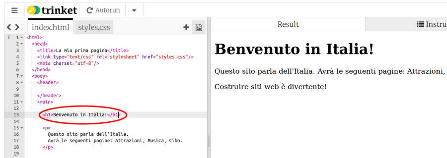

1. Nel pannello di sinistra, il **pannello del codice**, clicca sulla linguetta dove è scritto "index.html".
2. Trova la linea dove è scritto "Benvenuto in Italia!" e se vuoi modificala in modo che contenga il nome della tua città o della tua regione. Fai attenzione a non cancellare i caratteri `<p>` all'inizio della linea e i caratteri `</p>` alla fine. Se è selezionata la modalità "Autorun", il pannello di destra si aggiornerà automaticamente, altrimenti clicca sul pulsante "Click To Run". Il pannello di destra \(la pagina web\) si aggiornerà. 
3. Adesso, nella stessa linea, cambia i caratteri `<p>` e `</p>` in `<h1>` e `</h1>`. Cosa succede?
   ```html
    <h1>Benvenuto in Italia!</h1>
   ```


4. Per mettere del testo in una pagina web, è necessario inserirlo tra due **tag**. I tag "dicono" al browser come il testo deve essere visualizzato. Per esempio, il tag `<p>` indica al browser che il testo che segue è quello di un paragrafo, cioè un testo normale, mentre il tag `<h1>` indica un titolo.
   * I **browser** sono i programmi utilizzati per visualizzare i siti web, per esempio Firefox e Chrome.
   * Il nome del file termina in **.html** per indicare al browser che il file contiene una pagina web. Come conseguenza il browser cerca i tag all'interno dei file per sapere come rappresentare il testo. **HTML** è il linguaggio utilizzato per rappresentare il codice delle pagine web.
5. Perché servono due tag? Serve un primo tag di **apertura** per far sapere al browser dove inizia la sezione e un secondo di **chiusura  **per fargli sapere dove termina. Così per un paragrafo, il tag `<p>` all'inizio dice al browser: "qui troverai del testo che deve essere rappresentato come un paragrafo", mentre il tag `</p>` alla fine dice al browser che il paragrafo è terminato. Tutto quello compreso tra i tag `<body>` e `</body>` è l'intera pagina web.

   * Notare come il tag di **chiusura** utilizza una barra `/`.
   * I tag definiscono le varie parti della pagina, per esempio paragrafi e titoli, o l'intero corpo \(body\) della pagina; queste parti sono chiamate **elementi**. e bisogna pensare a loro come agli **elementi costitutivi** \(building block\) della pagina..

6. Prova a cambiare il tag `p` in `h2` nella paragrafo dove è scritto "Costruire siti web è divertente". Ricordati di cambiare sia il tag di ** apertura** `<p>` che quello di **chiusura** `</p>`.

7. Cerca i tag `<title>` e `</title>` e cambia il testo contenuto tra essi in "La mia prima pagina web". Premi il pulsante "Click to run" se necessario. 

   * Il titolo è il testo che normalmente si vede nel tab o nel titolo della finestra del browser. Trinket non la mostra ma la vedremo successivamente dopo aver scaricato il codice.

8. Cerca il codice del paragrafo dove è scritto: "Questo sito parla dell'Italia" e cambialo nel seguente modo:

   ```html
      <p>
         <em>Questo sito</em> parla dell'<strong>Italia</strong>.
         Avrà le seguenti pagine: Attrazioni, Musica e Cibo.
      </p>
   ```

   * Riesci a capire a cosa servono i tag  `<em> </em>` e `<strong> </strong>`?

   Nota: "em" è l'abbreviazione della parola inglese "emphasis" \(enfasi\).

9. Clicca sul pulsante "**Save**" in alto a destra per salvare le modifiche effettuate.

10. Riassumendo: una pagina web è un testo con dei tag che controllano come visualizzarlo in un browser!

    * Abbiamo visto i tag `p` per i paragrafi e il tag `h` per i titoli. Per vedere come vengono rappresentati differenti tipi di titolo, prova ad aggiungerne altri, cambiano il numero accanto alla lettera "h". Si può andare da `<h1>` fino ad `<h6>`. Se ti va, prova ad aggiungere altro testo inserendo nuovi tag `<p> </p>`.


