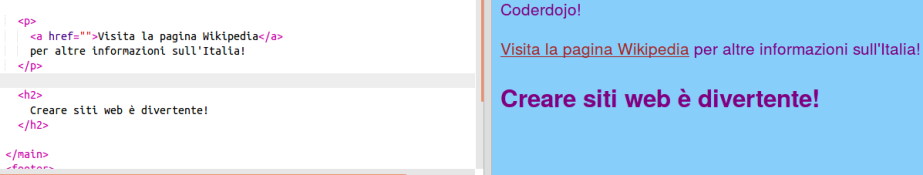

1. Se vogliamo convertire un testo in un link, dobbiamo metterlo tra i tag `<a> </a>`. Per esempio, per creare un link alla pagina delle attrazioni creata al passo precedente occorre fare così: 
   ```html
      <a href="attrazioni.html">Attrazioni</a>
   ```
 * L'attributo **href** fornisce al browser l'indirizzo della pagina da linkare. Come per gli altri attributi, il valore deve essere all'interno delle virgolette.
2. Modifica il file `index.html` nella sezione con la lista delle pagine, e facciamo diventare ogni riferimento un link a una pagina. Aggiungiamo anche un link per la pagina principale.
   ```html
   <ul>
      <li><a href="index.html">Pagina principale</a></li>
      <li><a href="attrazioni.html">Attrazioni</a></li>
      <li><a href="musica.html">Musica</a></li>
      <li><a href="cibo.html">Cibo</a></li>
   </ul>
   ```
3. Adesso è possibile navigare tra le varie pagine! Provare a cliccare sui link che abbiamo appena creato e vediamo cosa succede (le pagine per la musica e il cibo devono essere create come fatto per la pagina delle attrazioni).
4. I link, utilizzando gli stessi tag, possono puntare anche a pagine esterne. Inseriamo il codice per aggiungere un link alla pagina Wikipedia sull'Italia. Per il momento lasciamo l'attributo **href** vuoto: 
   ```html
   <p>
      <a href="">Visita la pagina Wikipedia</a> per altre informazioni sull'Italia!
   </p>
   ```
5. Apri il sito a cui vuoi fare riferimento, clicca sulla barra dell'indirizzo e seleziona tutto il testo: questo è l'indirizzo completo della pagina web aperta. Per copiare l'indirizzo, premi il tasto **Ctrl** \(o **cmd**\) e, mantenendolo premuto, premi il tasto **C**. 
 * **Nota:** In Trinket funzionano solo i link che iniziano con **https://** (la **s** significa "**sicuro**"). Se la pagina che si vuole linkare inizia con **http://** su Trinket non sarà possibile aprirla, ma tutto funzionerà comunque una volta che avremo scaricato il progetto.
6. Torna adesso al tuo codice, clicca tra le virgolette accanto ad **href** (assicurati di vedere il cursore che lampeggia nel punto giusto) e quindi **incolla** il testo copiato premendo contemporaneamente i tasti **Ctrl** \(o **cmd**\) e **V**. Osservare come diventa la nostra pagina! 
7. Utilizzando lo stylesheet, è possibile assegnare ai link il colore che preferiamo. Vai al file `styles.css` e aggiungi le seguenti regole. Nota che il selettore per i link è `a`. Scegli il colore che preferisci, possibilmente diverso da quelli già utilizzati:
   ```css
   a {
      color: Brown;
   }
   ```