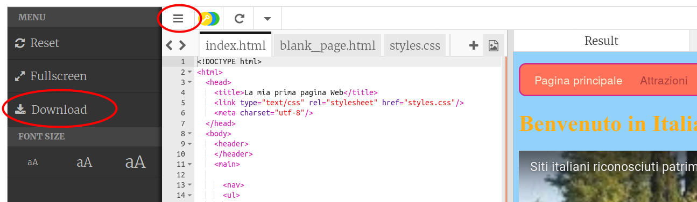
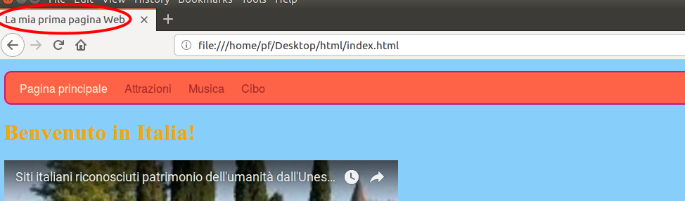

1. Vediamo adesso come scaricare sul PC il codice realizzato e come aprirlo con un browser. Nell'angolo in alto a sinistra della finestra del codice clicca sull'icona con le tre linee orizzontali e quindi clicca su "Download". 
2. Verrà scaricato un file zip che contiene tutti i file del tuo sito web. Estrai i file in una directory sul tuo computer.
3. Apri la directory con i file e cerca il file chiamato `index.html`. Ricorda: questo file è l'home page del tuo sito! Fai doppio click sul file: in questo modo il file verrà aperto con un **Browser**. Clicca su link ed esplora il sito web in tutta la sua gloria!
4. Osserva il titolo della pagina sul tab del browser o sulla finestra. Guarda come cambia quando si selezionano le varie pagine. Questo è il testo che hai messo tra i tag `<title> </title>` 
5. Lascia la pagina aperta nel browser e torna sulla finestra con la lista dei file. Trova di nuovo il file `index.html`. Questa volta clicca su di esso con il tasto destro nel mouse  \(sul Mac, clicca e mantieni o clicca con due dita!\), seleziona "Apri con &gt;" e scegli un editor di testo semplice come Notepad, Notepad++, Sublime Text o GEdit. Una volta aperto, dovresti vedere tutti i tag HTML esattamente come su Trinket.
 * Se stai usando un Mac, prima di effettuare questa operazione potrebbe essere necessario installare un editor di testi
6. Come ormai sai, una pagina web è fatta di testo con dei tag che controllano come viene rappresentato. A questo punto puoi vedere come la pagina web e il codice sono di fatto lo stesso file: a seconda di come lo apri vedrai cose diverse: se lo apri con un **browser** vedrai la **pagina web** \(solo il testo\), se lo apri con un **editor di testo** vedrai il **codice** \(testo e tag\).
7. Congratulazioni! Adesso condividi il tuo progetto con altre persone per mostrare quello che hai fatto. Su Trinket, clicca sul pulsante **"Share"** accanto al pulsante Save e seleziona una delle opzioni
 

