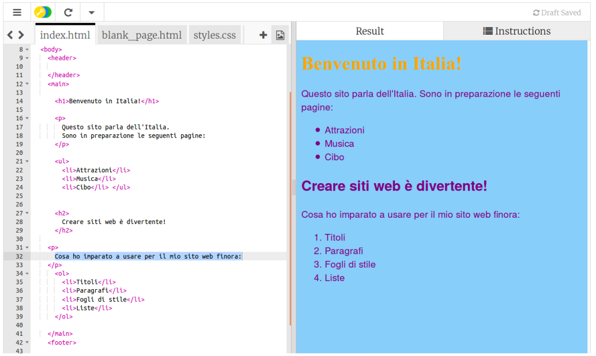

1. Quando si scrive una lista, non sarebbe bello se gli elementi venissero automaticamente rappresentati come una lista vera e propria? Ci sono tag html proprio per ottenere questo risultato! Apriamo nuovamente la linguetta con il file index.html e cambiamo il codice del paragrafo nel seguente modo: 
   ```html
    <p>
       Questo sito parla dell'Italia. 
       Sono in preparazione le seguenti pagine:
    </p>
    <ul>
       <li>Attrazioni</li>
       <li>Musica</li>
       <li>Cibo</li>
    </ul>
   ```
2. Osserva come il testo è stato convertito in una simpatica lista! 
3. I tag `<ul> </ul>` delimitano la lista nella sua interezza, e sono loro che hanno permesso di convertire il testo nella lista che appare adesso. "ul" significa **unordered list** ossia **lista non ordinata**, cioè una lista senza numeri. Ogni elemento della lista deve stare tra i tag `<li> </li>`. "li" significa **list item**, ossia **elemento di lista**. 
   * Divertiti a cambiare gli elementi della lista in base a quello che vuoi mettere sul tuo sito web. Il tuo sito può essere su qualsiasi argomento ti interessi e non necessariamente sull'Italia!
4. E se volessimo una lista numerata? E' praticamente la stessa cosa, solo che al posto di `ul` dobbiamo usare `ol`, ossia **ordered list** (in italiano **lista ordinata**). Aggiungi il seguente codice prima del tag `</main>`:
   ```html
   <p>
      Cosa ho imparato a usare per il mio sito web finora:
   </p>
   <ol>
      <li>Titoli</li>
      <li>Paragrafi</li>
      <li>Fogli di stile</li>
      <li>Liste</li>
   </ol>
   ```
5. Dopo questa modifica, ecco come dovrebbe apparire il sito web 


