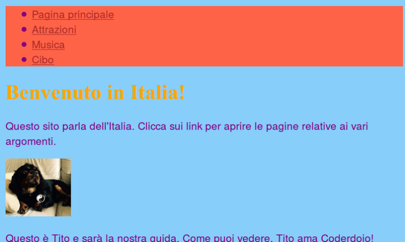
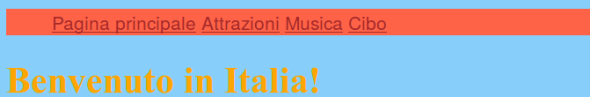
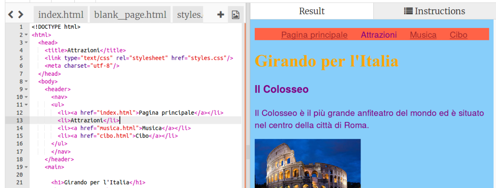

1. Vediamo adesso come trasformare il menù di navigazione in una appariscente barra modificando le regole all'interno del file **CSS**. 
2. April il file di stile cliccando sul tab styles.css. Clicca _dopo_ una parentesi graffa chiusa `}` e premi invio per andare su una nuova linea. Inserisci quindi la seguente regola:
   ```css
      nav ul {
         background-color: tomato;
      }
   ```
3. Nota come questa volta abbiamo utilizzato **due selettori** invece di uno solo. Se avessimo usato solo il selettore `ul`, lo regola avrebbe causato la modifica di tutte le liste non ordinate presenti nel sito. Aggiungendo il selettore `nav` abbiamo fatto in modo che le regole si applicano solo alle liste all'interno dei tag `nav`.
4. Ecco come apparirà la pagina dopo questa modifica: 
5. Vediamo adesso come eliminare i punti all'inizio delle linee. Clicca nuovamente sul tab `styles.css` e aggiungi il seguente blocco nel file. Come prima, il blocco va inserito su una nuova linea dopo una `}` (altrimenti il blocco sarebbe dentro un altro blocco di regole e non funzionerebbe).
   ```css
   nav ul li {
      list-style-type: none;
   }
   ```
Nota come questo insieme di regole ha _tre_ selettori. Stiamo selezionando tutti gli elementi di tipo `li` che si trovano in una lista di tipo `ul` all'interno di una sezione `nav`!
6. Per avere la lista orizzontale invece di verticale, basta aggiungere le linea `display: inline;` all'interno del blocco che abbiamo appena inserito  
 Gli elementi del menù appariranno adesso tutti compattati su un'unica linea. Utilizziamo le proprietà `margin-right` e `margin-left` per spaziarli un po'. Il blocco di regole alla fine dovrà essere il seguente:
   ```css
   nav ul li {
      list-style-type: none;
      display: inline;
      margin-right: 10px;
      margin-left: 10px;
   }
   ```
   Ricorda che `10px` significa 10 **pixel**.
7. Che ne dici adesso di modificare il menù in modo che faccia capire in quale pagina ci troviamo? Per ottenere questo risultato modificheremo direttamente le pagine HTML.
8. Cominciamo dalla pagina principale (homepage). Vai al file `index.html` e nella lista rimuovi il tag di tipo link (`<a>`) prima e dopo il testo "Pagina principale" cosicché il testo sia solo tra i tag `<li> </li>`. Il risultato sarà: `<li>Pagina Principale</li>`.
9. Adesso apri ciascuno degli altri file e fai la stessa cosa, rimuovendo il link sulla linea della pagina che stai editando. Per esempio, per la pagina `attrazioni.html` rimuovi il link attorno al testo "Attrazioni", e così via.
 
 Clicca su "Run" ed esplora le pagine. Vedi come la barra del menù mostrerà la pagina dove ti trovi come testo normale invece che come un link? 
