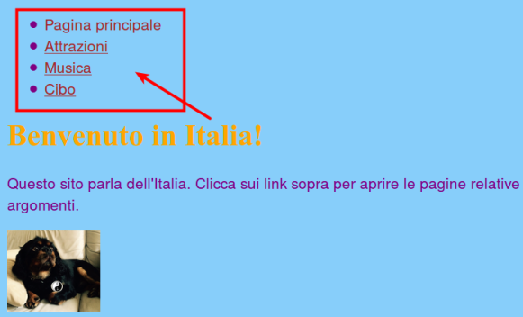
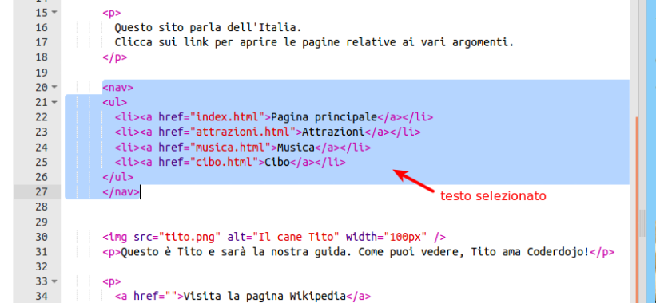

1. Per rendere facile lo spostamento tra le varie pagine, molti siti web utilizzano un menù di **navigazione**. Adesso che abbiamo un certo numero di pagine, con una pagina principale e un insieme di link per spostarsi tra le varie pagine, spostiamo i link in una sezione di navigazione in cima alla pagina. 
2. Immediatamente _prima_ del tag di _apertura_ `<ul>`, premi Invio e crea una nuova linea vuota. Nella linea vuota scrivi il seguente tag:  `<nav>`. Trinket automaticamente aggiunge il tag di chiusura. Per il momento cancelliamolo.
3. Subito _dopo_ il tag di _chiusura_ `</ul>`, premi nuovamente Invio e, nella nuova linea scrivi il tag di chiusura `</nav>`. 
   * "nav" sta per **navigazione**. La sezione `nav` è un insieme di tool utili per muoversi all'interno di un sito web.
4. A questo punto, seleziona l'intera sezione `nav` con la lista al suo interno. Per fare questo clicca con il mouse immeditamente prima del tag di apertura `<nav>` tag e, mantenendo premuto il tasto del mouse, trascinare il cursore fino a comprendere tutto il tag di chiusura  `</nav>`cosicchè tutto il testo compreso tra i tag di apertura e chiusura risulta evidenziato. Fare attenzione che tutte le **parentesi angolari** `<` e `>` siano comprese nella selezione! 
5. Invece di copiare, questa volta **taglieremo** il testo. Per farlo premi e mantieni premuto il tasto **Ctrl** \(o **cmd**\) e premi quindi in tasto **X**. Il codice scomparirà, ma non preoccuparti!
6. All'inzio del file, clicca nello spazio tra i tag `<header> </header>` e assicurati che il cursore stia lampeggiando proprio in quella zona. A questo punto **incolla** il codice tagliato in precedenza premendo i tasti  **Ctrl** \(o **cmd**\) e **V** insieme come al solito. Il codice dovrebbe appararire come quello riportato sotto:
   ```html
   <header>
      <nav>
         <ul>
            <li><a href="index.html">Home</a></li>
            <li><a href="attrazioni.html">Attrazioni</a></li>
            <li><a href="musica.html">Musica</a></li>
            <li><a href="cibo.html">Cibo</a></li>
         </ul>
      </nav>
   </header>
   ```

   * In caso di errori, si può tornare indietro (fare "**undo**"), premendo i tasti**Ctrl** \(o **cmd**\) e **Z** insieme. Premendolo più volte si può tornare indietro di più passi. Ricorda bene questa funzionalità perché può essere utile in molte situazioni!
7. Per far si che il menù di navigazione appaia in cima a tutte le pagine del sito, si deve mettere il codice della sezione `<nav>`, in tutte le pagine create. Selezionare l'intera sezione `nav` come fatto in precedenza, e premi i tasti **Ctrl** \(o **cmd**\) e **C** insieme per **copiare** il codice. Quindi cliccare nella sezione tra i tag `<header> </header>` di tutte le pagine e **incollare** il testo esattamente come fatto nel passo 6.
9. Adesso cliccando su Run, potrai navigare tra le pagine cliccando sui link a questo punto presenti in tutte le pagine. Ricordati di cliccare su "Save" una volta terminato!


