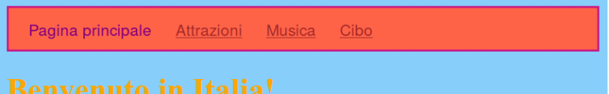
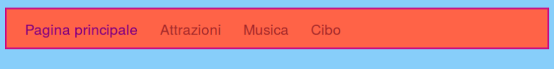
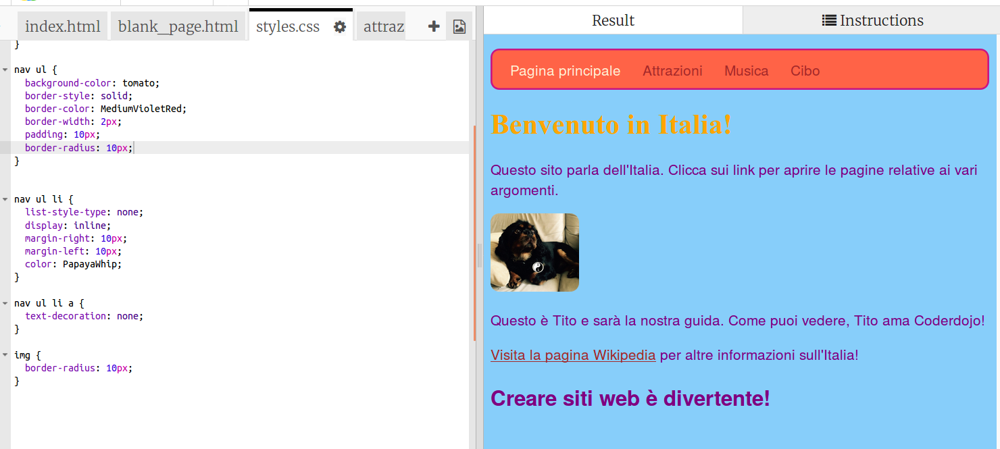

1. Utilizzando il CSS, esistono infinite possibilità per rendere la barra dei menù sempre più graficamente interessante. Apri di nuovo il file styles.css \(è qui che avviene la magia!\) Ogni volta che fai una modifica osserva come cambiano le pagine del sito.
2. Trova il selettore `nav ul` e aggiungi ulteriori regole fino a raggiungere quanto riportato sotto::
   ```css
      nav ul {
        background-color: tomato;
        border-style: solid;
        border-color: MediumVioletRed;
        border-width: 2px;
        padding: 10px;
      }
   ```
La proprietà `padding` aggiunge spazio. Riesci a capire cosa fanno le altre proprietà? Prova a sperimentare utilizzando colori o numero di pixel diversi. 
3. Per togliere le sottolineature ai link, aggiungi le seguenti regole in un nuovo blocco di codice. Ricordati che un nuovo blocco di codice deve sempre iniziare dopo una parentesi graffa chiusa `}`, per esempio dopo il blocco di regole `nav ul li`.
 * Infatti, anche se è possibilie mettere i blocchi nell'ordine che vogliamo, è una buona regola tenere insieme blocchi simili. In questo modo sono più facili da trovare!
   ```css
      nav ul li a {
         text-decoration: none;
      }
   ```
Questa regola si applica ai _link_ \(tag `<a>`\) all'interno di _elementi di lista_ di  _liste non ordinate_ denstro sezioni di _navigazione_ \(`nav`\). Wow! Abbiamo appena utilizzato _quattro selettori_! 
3. Ricordi come abbiamo tolto il tag link agli elementi della lista che rappresentavano le pagine correnti? In questo modo capivamo facilmente in quale pagina ci trovavamo. Che ne dici di cambiare anche il colore testo di queste etichette che non sono link? Trova il selettore  `nav ul li` selector, e aggiungi la linea: 
   ```css
      color: PapayaWhip;
   ```
   all'interno delle parentesi graffe. Scegli il colore che preferisci! 
 * E' possibile aggiungere la proprietà `color` nel blocco di regole `nav ul li a` in modo che il colore dei link nella barra dei menù sia diversa dai link messi nelle altre sezioni della pagina.
4. E che ne dici adesso di avere angoli stondati? Aggiungi la regola `border-radius: 10px;`
nella sezione `nav ul` e osserva cosa avviene. 
 * La proprietà `border-radius` è un modo facile per avere un look della pagina molto più accattivante! Come ulteriore sfida, aggiungi al foglio di stile un nuovo set di regole per le immagini, utilizzando il selettore `img`, e aggiungici una regola `border-radius`.  
5. Ecco come dovrebbe apparire il foglio di stile e la pagina dopo tutte queste modifiche. 
