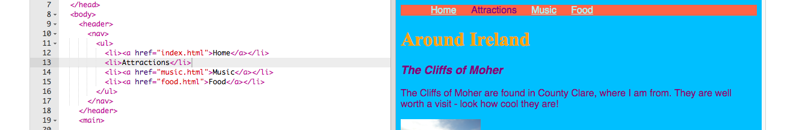

1. スタイルシートに**CSS**ルールを追加することで、ナビゲーションメニューをクールなデザインのメニューバーに変えることができます！
2. スタイルシートファイルに移動します。これは「styles.css」タブにあります。閉じるほうの中かっこ`}`のすぐ後をクリックして からEnterキーを押すと、新しい行に移動します。次のルールを追加します。
   ```
      nav ul {
         background-color: tomato;
      }
   ```
3. 1つではなく**2つのセレクタ**を使ったことに気づきましたか？ `ul`セレクターだけを指定すると、そのルールはWebサイトの「すべての順序無しリスト\(ul\)」に影響します。 `nav`セレクタをあわせて指定すると、「`nav`タグにはさまれた部分にあるリスト\(ul\)」にのみ適用されます。
4. どんな表示になるか「Click to Run」を押して確認します。 
5. 中点\(・\)を消しましょう。\(各リスト項目の前にある点のことです。\) `styles.css`タブに移動して、こちらのコードを追加します。追加したら、もう一度`｝`の後に改行しておきましょう。そうすると、まちがって他のルールのところに書いてしまうことがなくなります。

   ```
   nav ul li {
      list-style-type: none;
   }
   ```

   このルールには**3つのセレクタ**があることに注意してください！`nav`セクション内にある`ul`リスト内にあるすべての`li`要素を選択します。ふう～！

6. では、リストを垂直（上下）方向の並びではなく、水平（左右）方向の並び順にしましょう。新しい行を追加します。`display：inline;`と、`margin-right`と`margin-left`プロパティを追加して、メニュー項目のスペースを少し空けてみましょう。ルールは次のようになります。

   ```
   nav ul li {
      list-style-type: none;
      display: inline;
      margin-right: 10px;
      margin-left: 10px;
   }
   ```

   `10px`は 10 **ピクセル**を表します。

7. どのページを表示しているのか分かるようにメニューを変えてみませんか？　これはスタイルシートには書きません。

8. 「home」ページから変えていきましょう。 `index.html`ファイルに移動します。リストの中で、「Home」ページのリスト項目が`<li> </ li>`タグの間で、ただのテキストになるように、 "Home"という単語の前後にあるリンクタグを削除します。こんなように。`<li> Home </ li>`

9. 他のファイルにも移動して、同じことをしていきます。編集するページそれぞれのリストについて、リンクタグを削除します。たとえば、`music.html`ファイルでは`"Music"`のリスト項目のリンクタグを削除します。

10. 「Click To Run」を押して、ページを確認しましょう。. メニューバーでいまどこのページにいるかを表すために、リンクの代わりにプレーンテキストになっていることがわかるでしょう。


