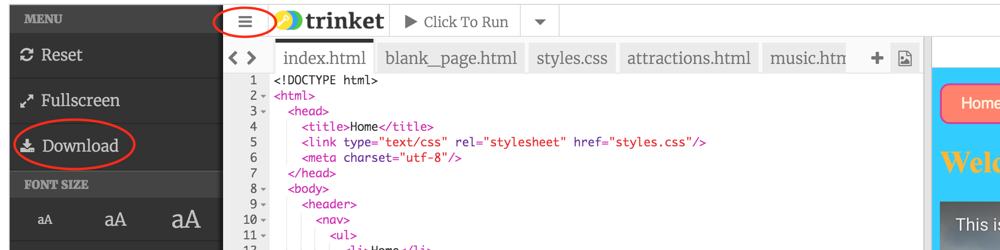

1. Laten we je code downloaden en bekijken ! In de linker top hoek van het code paneel, klik op  het menu icoon dat lijkt op die horizontale lijntjes en klik Download.  
2. Een zip bestand wordt gedownload. Het bevat alle bestanden voor je website. Pak de zip file uit in een folder op je computer. 
3. Open de uitgepakte folder en zoek het bestand genaamd index.html. Onthoud dat dit bestand je homepagina is. Dubbel klik het om het in een **browser** te openen. Klik de links en verken je website in al zijn glorie!
4. Je kan de pagina titel zien in de top van de tab of window. Merk de titel op in elka pagina. Dit is de tekst die je tussen de  `<title> </title>` tags zette.
5. Laat het browser venster open, en ga terug naar het venster met de lijst van bestanden. Zoek de index.html. Rechts klik er nu op \(om te "rechts klikken" op een Mac, klik en hou vast, of klik met twee vingers!\), 
   select "Open With &gt;" and choose a plain text editor such as Notepad, Notepad++ or Sublime Text. You should see all the HTML tags, like in the code panel on Trinket.

* If you are using a Mac, you may need to install a plain text editor first

1. As you know, a web page is just made up of text, with tags to control it. Now you can see that the web page and the code are in fact the same file: depending on whether you open it in a **browser** or a **plain text editor**, you will see either the **code** \(text and tags\) or the **web page** \(just text\).
2. Congratulations! Why not share your project with other people to show it off? In Trinket, click the Share button \(next to the Save button\) and select one of the options.
   

