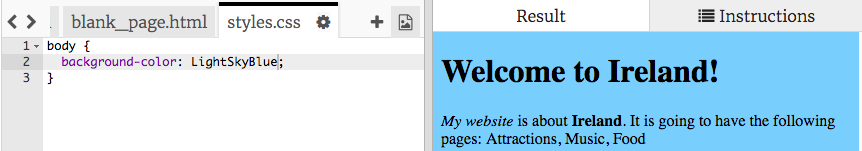
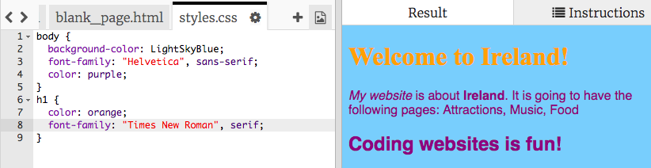

1. V Trinkete si všimni záložky v ľavom paneli a vyber si **styles.css**. Ak takúto záložku nevidíš, použi tlačidlá **<** a **>** až kým ju nenájdeš.
   * **CSS** je kód, ktorý hovorí, ako presne bude stránka vyzerať.

2. V tomto súbore sa nachádza tento text:
  ```css
  body {
     background-color: white;
  }
  ```
   
3. Zložené zátvorky `{ }` a text medzi nimi vyznačujú **CSS pravidlá**. Slovo `body` znamená, že tieto pravidlá platia pre všetky `<body>` elementy na tvojej stránke. To, čo je pred zloženými zátvorkami, nazývame **selektor**. Takže v tomto prípade máme **selektor** pre elementy **body**.

4. Zmeň farbu na `LightSkyBlue` a klikni na ► Run. Tvoja stránka by teraz mala mať bledomodré pozadie (angl. _background_)! 

5. Ako to funguje? Keď sa pozrieš na hornú časť súboru index.html, uvidíš tam tento riadok:
```html
<link type="text/css" rel="stylesheet" href="styles.css"/>
``` 
Tento riadok povie prehliadaču, aby hľadal špeciálny súbor s menom styles.css. Tento typ súboru sa nazýva **stylesheet** (čítaj: stajlšít), teda hárok so štýlmi. Stylesheet obsahuje pravidlá toho, ako by mal každý element na tvojej stránke vyzerať.
  * Každé pravidlo sa skladá z **vlastnosti**, dvojbodky `:` a **hodnoty** pre vlastnosť. Pravidlá sú vždy ukončené bodkočiarkou `;`.

6. Zmeňme text na stránke novými pravidlami. Pridaj dva nové riadky medzi zložené zátvorky:
  ```css
  body {
     background-color: LightSkyBlue;
     font-family: "Helvetica", sans-serif;
     color: purple;
  }
  ```
7. Klikni na Run a pozri sa, ako sa tvoja stránka zmenila.
   * Vlastnosť `color` (farba) platí pre text.

8. Môžeme pridať aj pravidlá, ktoré odlíšia nadpisy od odstavcov! Na toto budeme potrebovať selektor `h1`. Pridaj nasledujúci kód do súboru styles.css, za poslednou zloženou zátvorkou:
   ```css
   h1 {
      color: orange;
      font-family: "Times New Roman", serif;
   }
   ```
   
9. Klikni na Run. Tvoj nadpis by teraz mal byť oranžový a tvoje odstavce fialové, tak ako predtým. 

10. Vidíš, ako sa okrem farieb zmenil aj tvar písmen? Je to tak preto, lebo sme zmenili vlastnosť `font-family`. Viac písiem (tzv. fontov) môžeš nájsť napríklad na [dojo.soy/font-families](http://dojo.soy/web-font-families).

11. Pridaj nové pravidlá pre nadpisy `<h2>` pomocou selektoru `h2`.

12. Prečo neskúsiť iné farebné kombinácie pre text a pozadie? Farieb máš k dispozícií naozaj veľa: [dojo.soy/web-color-names](http://dojo.soy/web-color-names).