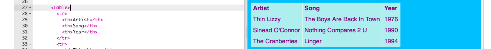

1. Niekedy je dobré ukázať informácie na stránke vo forme tabuľky. Napríklad, ak chceš zobraziť zoznam členov tvojho futbalového klubu, alebo na hitparádu pesničiek. Tabuľka je mriežka, ktorá sa skladá s **riadkov** a **stĺpcov**. Väčšina tabuliek má v prvom riadku popis každého stĺpca – **hlavičku**.

2. Prejdi do súboru page\_with\_table.html. Nájdeš tam kód medzi tagmi `<table> </table>`. Skopíruj tieto tagy spolu s kódom medzi nimi a vlož ich na niektorú z tvojich podstránok.

3. Momentálne je tvoja tabuľka prázdna. Tu je príklad tabuľky s vyplnenými informáciami:
  ```html
    <table>
      <tr>
        <th>Artist</th>
        <th>Song</th>
        <th>Year</th>
      </tr>
      <tr>
        <td>Thin Lizzy</td>
        <td>The Boys Are Back In Town</td>
        <td>1976</td>
      </tr>
      <tr>
        <td>Sinead O'Connor</td>
        <td>Nothing Compares 2 U</td>
        <td>1990</td>
      </tr>
      <tr>
        <td>The Cranberries</td>
        <td>Linger</td>
        <td>1994</td>
      </tr>
    </table>
  ```
4. And here's what it looks like on the website: 
5. Let's have a look at all those tags. It's a bit like the code for a list \(remember `<ul>` and `<ol>`?\) but with more levels.
 * Each pair of `<tr> </tr>` tags is a **row**. So everything in between them will be displayed on one line.
 * The first row contains `<th> </th>` tags. These are used for the **headers**, so the column titles go in between them. There is one pair for each column you have in your table.
 * The `<td> </td>` tags stand for **table data**, and that's what goes in all the other rows. These are like the list item `<li> </li>` tags in a list: everything in between them is one item in your table row.
6. Try filling your table with anything you like! Simply put text in between the `<td> </td>` tags and also in between the `<th> </th>` tags. You can add more tags if you need to.
 
  To add another **row**, you add another set of `<tr> </tr>` tags. In between them you put the same number of **data** items with `<td> </td>` tags as you have in the other rows.
 
  To add another **column** you add an extra **data** item with a set of `<td> </td>` tags onto every row. You also add an extra **header** item to the first row, using `<th> </th>` tags.
7. If you look at the end of the styles.css file, you will see the CSS code that describes how the table should look. You don't have to understand all of it! But you can experiment with changing the text, border and background colours to design your own style.
  ```css
    table, th, td {
      border: 1px solid HoneyDew;
      border-collapse: collapse;
    }
    tr {
      background-color: PaleTurquoise;
    }
    th, td {
      vertical-align: top;
      padding: 5px;
      text-align: left;
    }
    th {
      color: purple;
    }
    td {
      color: purple;
    }
  ```
  Notice how some of the selectors use **commas**, for example `table, th, td`? This is a _list of selectors_: it means it applies to _all_ `<th>` elements _and all_ `<td>` elements. It saves typing out the same set of rules again for each selector!