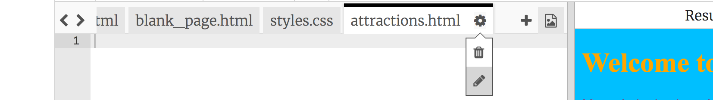
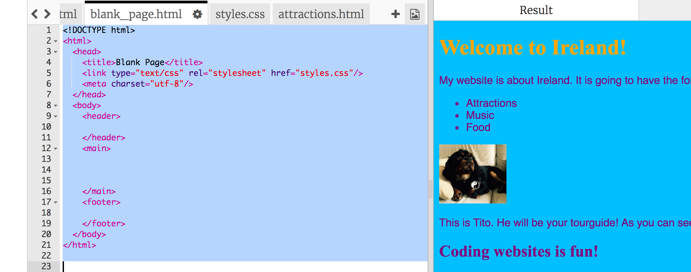
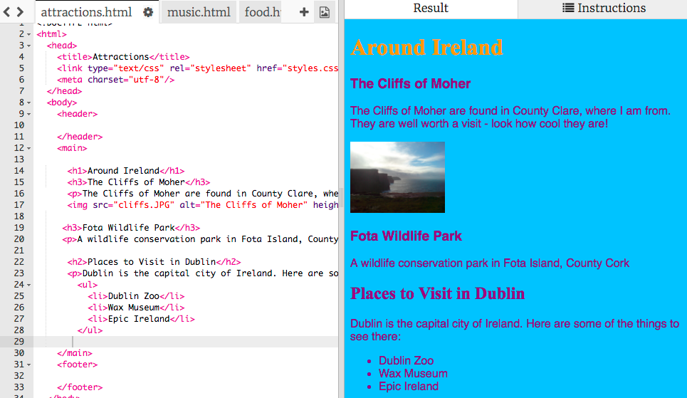

1. Už vieš, aké podstránky chceš mať na svojej stránky, tak ich poďme vyrobiť! Na vytvorenie novej podstránky, potrebuješ nový súbor, ktorý sa bude končiť na **.html**. Na vrchu panelu s kódom klikni na symbol **+**. Týmto vytvoríš nový súbor. Názov tvojho nového súboru by mal končiť na **.html** (vrátane bodky), aby prehliadač vedel, že sa jedná o webovú stránku.

   * Ak chceš zmeniť meno existujúceho súboru, klikni na ikonu ozubeného kolieska napravo od názvu súboru a potom klikni na ceruzku. Podobne môžeš súbor aj vymazať: kliknutím na ikonu smetného koša namiesto ceruzky.
   
2. Možno sa pýtaš, prečo nie je možné zmeniť názov súboru index.html. "index.html" je špeciálny názov pre **domovskú stránku** webu. Je to prvá podstránka, ktorá sa ti zobrazí, keď prehliadačom prídeš na nejakú stránku. Prehliadač väčšinou hľadá súbor s názvom index.html a ten zobrazí ako prvý.

3. Choď do súboru blank_page.html v paneli s kódom. Vyber všetok text v tomto súbore pomocou myši, alebo klávesovou skratkou **Ctrl+A** (Drž stlačený kláves Ctrl a potom stlač A).

4. Teraz označený text skopíruj pomocou klávesovej skratky **Ctrl+C**

5. Prepni sa do súboru, ktorý si vytvoril/a v kroku 1. Vlož skopírovaný text zo súboru blank_page.html pomocou klávesovej skratky **Ctrl+V**.

 * Skratky Ctrl+C a Ctrl+V fungujú aj v iných programoch, môžeš nimi kopírovať aj celé súbory!
 
6. Zmeň text medzi tagmi `<title> </title>` aby tvoja nová podstránka mala vhodný popis.

7. Medzi tagy `<main> </main>` vlož akékoľvek tagy ktoré už poznáš: pridaj nové odstavce, nadpisy, zoznamy alebo obrázky!

8. Opakuj kroky 1 až 7 pre každú novú podstránku, ktorú chceš pridať. Ak máš nad panelom s kódom príliš veľa záložiek, môžeš ich posúvať pomocou tlačidiel **<** a **>** v ľavom hornom rohu.

  
  
9. Na ďalšej strane sa naučíš ako vytvárať **odkazy**, aby sa na tvojom webe dalo prechádzať medzi stránkami.

