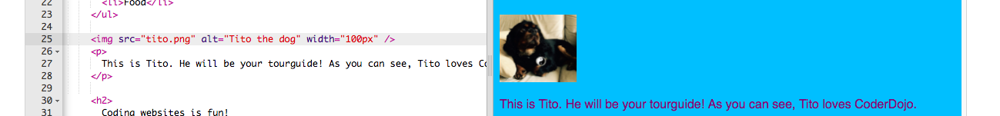
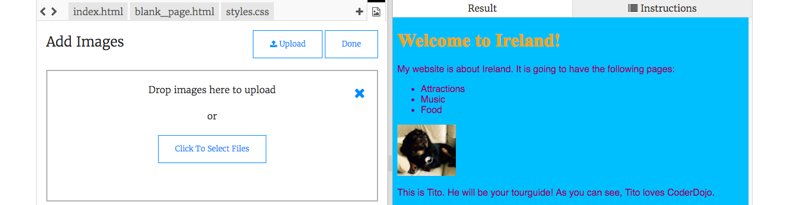

1. Klikni na ikonu obrázku vedľa znaku **+** v pravom hornom rohu panelu s kódom. Uvidíš tu obrázky, ktoré môžeš použiť na tvojej stránke. Zatiaľ použi obrázok, ktorý už je nahratý.

2. Prejdi na súbor index.html v paneli s kódom. Pod tag `</ul>` vlož tento kód:
```html

```

Všimni si, že tag `` je odlišný od iných tagov, ktoré si zatiaľ použil/a. 
   * Nemá žiaden zatvárací tag `</img>` tag. Namiesto toho je **samozatvárací**: má na konci `/>`. V tomto prípade nemáme "začiatok" a "koniec", ako keď sme vkladali text.
   * Tag obsahuje tri ďalšie údaje ktoré voláme vlastnosti, alebo **atribúty**. Atribút `src` hovorí prehliadaču, kde sa nachádza súbor s obrázkom. Atribút `alt` je krátky popis, ktorý prehliadač ukáže, ak obrázok nedokáže zobraziť.
   
4. Čo podľa teba robí atribút `width` (z angl. _šírka_)? (Pomôcka: **px** je skratka pre **pixely**, teda bodky, z ktorých sa skladá tvoja obrazovka.) Vyskúšaj vo `width` nastaviť rôzne čísla. Nezmaž písmená `px`.

5. Ak chceš pridať na svoju stránku obrázok, klikni znova na ikonu obrázku a klikni na "Add Image". Klikni na "Upload" a potom označ "Click To Select Files". Vyber si obrázok v tvojom počítači, ktorý chceš nahrať a klikni na "Open". Nakoniec klikni na "Done" a potom na "Save" na uloženie tvojej práce.

**Poznámka:** Skontroluj si meno tvojho obrázka predtým, než ho nahráš a **premenuj** ho na niečo, čo sa dá ľahko prepísať. Meno obrázka by nemalo obsahovať žiadne písmená s mäkčeňmi, dĺžňami a podobnými znakmi.

  
 
6. Keď je tvoj obrázok nahraný, môžeš ho pridať na tvoju stránku pomocou ďalšieho tagu ``. Zmeň hodnotu atribútu `src` tak, aby bol presne rovnaký ako meno tvojho obrázka. Zmeň aj hodnotu atribútu `alt` na krátky popis tvojho obrázka. _Dôležité:_ hodnoty atribútov musia byť v úvodzovkách!


