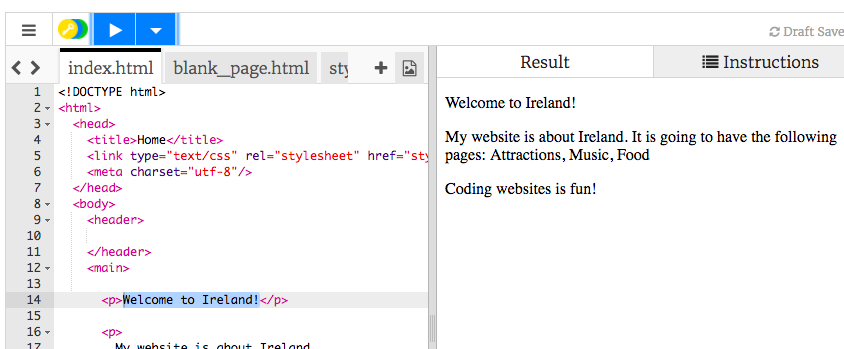
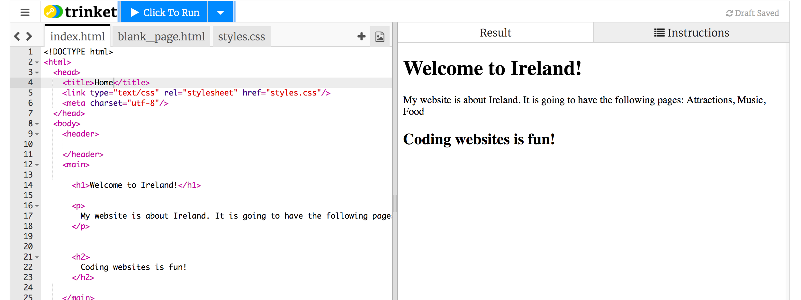

1. V ľavom paneli, v **paneli s kódom**, klikni na záložku, na ktorej je napísané "index.html"
2. Nájdi riadok, v ktorom je napísané "Welcome to Ireland!" a zmeň ho na inú krajinu alebo mesto. Dávaj si pozor aby si nezmazal/a `<p>` na začiatku a `</p>` na konci riadku. Potom klikni na tlačidlo **► Run**. V pravom paneli sa tvoja stránka zmení. 
3. Teraz v tom istom riadku zmeň, `<p>` a `</p>` na `<h1>` a `</h1>`. Klikni na Run. Čo sa stane?
  ```html
    <h1>Welcome to Ireland!</h1>
  ```
4. Ak chceš chceš dať na svoju stránku text, musíš ho napísať medzi dva **tagy**. Tagy hovoria tvojmu prehliadaču ako tvoj text zobraziť. Napríklad tag `<p>` označuje odstavec. Tag `<h1>` povie prehliadaču, že ide o nadpis.
   * **Prehliadač** je program, ktorý používaš na používanie webových stránok, napríklad Chrome alebo Firefox.
   * Prípona súboru index**.html** prehliadaču hovorí, že v súbore je webová stránka. **HTML** je kód, v ktorom sa vytvárajú webové stránky.
5. Prečo potrebuješ dva tagy? Existuje **otvárací** a **zatvárací** tag, ktorý prehliadaču hovorí, kde veci začínajú a kde končia. Takže `<p>` označuje kde odstavec začína a `</p>` kde odstavec končí. Všimni si, že všetok text tvojej stránky (jej "telo") sa nachádza medzi tagmi `<body>` a `</body>`.
   * Všimni si, že **zatváracie ** tagy majú vždy lomítko, `/`. 
   * Tagy označujú rôzne časti stránky, napríklad odstavce, nadpisy, alebo telo. Tieto časti sa nazývajú **elementy**. Môžeš si ich predstaviť ako časti skladačky.

6. Skús zmeniť `p` na `h2` v poslednom odstavci, kde je napísané "Coding websites is fun!". Nezabudni, že treba zmeniť **otvárací** tag `<p>` a aj **zatvárací ** tag `</p>`.
7. Nájdi tagy `<title>` a `</title>` a zmeň text medzi nimi na "Domov". Potom klikni na ► Run. 
  * Titulok `title` označuje text, ktorý sa zobrazuje na záložke prehliadača alebo v hornom okraji tvojho prehliadača. V Trinkete sa titulok nezobrazuje, ale uvidíš ho neskôr, keď si svoj kód stiahneš.
8. Nájdi kód pre odstavec, v ktorom sa píše "My website is about Ireland" a zmeň ho na toto:
   ```html
      <p>
         <em>My website</em> is about <strong>Ireland</strong>. 
         It is going to have the following pages: Attractions, Music, Food
      </p>
  ```
  * Vidíš, čo robia tagy `<em> </em>` a `<strong> </strong>`? Poznámka: "em" je skratka pre "emphasis", teda zdôraznenie alebo prízvuk.
8. Nájdi vpravo hore modré tlačidlo Save a ulož svoje zmeny.
9. Takže web stránka sa skladá z textu a z tagov, ktorými sa tvaruje!
  * Existujú tagy `p` pre odstavce a `h` pre nadpisy. Skús pridať viac nadpisov. Zmeň čísla v `h` tagoch a všimni si ako sa mení veľkosť tvojho nadpisu. Idú od `<h1>` až po `<h6>`. Alebo pridaj nové tagy `<p> </p>`!


