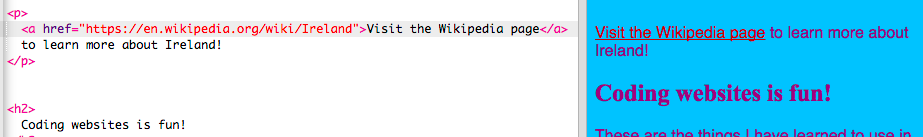

1. Na to , aby sa text premenil na odkaz, treba ho dať medzi tagy `<a> </a>`. Vyzerá to takto:
   ```html
      <a href="attractions.html">Attractions</a>
   ```
 * Atribút **href** prehliadaču povie adresu, kde sa stránka, na ktorú odkazuješ, nachádza. Tak ako všetky atribúty, aj hodnota pre href musí byť v úvodzovkách.

2. Otvor si súbor index.html a pridaj `<a> </a>` tagy ku každej položke v tvojom zozname. Text pre href v úvodzovkách uprav na presné názvy podstránok, ktoré si vytvoril/a v predchádzajúcej sekcii. Nezabudni pridať aj odkaz "Domov" na súbor index.html.
   ```html
   <ul>
      <li><a href="index.html">Home</a></li>
      <li><a href="attractions.html">Attractions</a></li>
      <li><a href="music.html">Music</a></li>
      <li><a href="food.html">Food</a></li>
   </ul>
   ```

3. Teraz sa môžeš pomocou odkazov dostať na tvoje nové podstránky! Klikni na Save a potom Run a odkazy si vyskúšaj.

4. Odkazy na iné webstránky vyzerajú skoro rovnako. Pridaj tento kód niekam na tvoju stránku. Nateraz necháme atribút **href** prázdny:

   ```html
   <p>
      <a href="">Visit the Wikipedia page</a> to learn more about Ireland!
   </p>
   ```
5. Choď cez prehliadať na webstránku na ktorú chceš vytvoriť odkaz. Klikni na adresové pole (tam, kde je adresa tvojej webstránky). Označ celú adresu a skopíruj ho pomocou **Ctrl+C**. 

   * **Poznámka:** V Trinkete fungujú iba odkazy ktoré začínajú na **https://**. Ak tvoj odkaz začína na **http://**, v Trinkete ti nebude fungovať, no keď si na konci stiahneš svoj projekt, odkazy s http:// ti pôjdu.
   
6. Teraz sa vráť k svojmu kódu. Klikni medzi úvodzovky a vlož adresu pomocou klávesovej skratky **Ctrl+V**. Klikni na Run a odkaz vyskúšaj. 

7. Tak ako každý iný text, aj odkazom môžeme meniť farbu v CSS stylesheete. Prejdi na súbor styles.css a pridaj nasledujúce pravidlá. Všimni si, že selektor pre odkazy je `a`. Vyber si farbu, aká sa ti páči. Klikni na Run a prezri si svoje zmeny.
   ```css
   a {
      color: Brown;
   }
   ```
