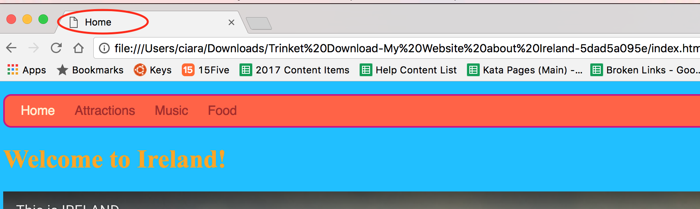

1. Stiahni svoj projekt a pozrime sa naň! V ľavom hornom rohu panelu s kódom klikni na ikonu menu, ktorá je označená troma čiarami. Klikni na Download. 

2. Do počítača sa ti stiahne zip súbor. V tomto súbore sa nachádzajú všetky súbory tvojej webstránky. Rozbaľ tento zip súbor (otvor ho a vytiahni z neho súbory von).

3. Open up the extracted folder and find the file called index.html. Remember this file is your homepage. Double click on it to open it up in a **browser**. Click the links and explore your website in all its glory!

3. Otvoj priečinok s rozbalenými súbormi a nájdi súbor, ktorý sa volá index.html. Toto je domovská podstránka tvojej stránky. Dvakrát klikni na tento súbor a otvor ho v **prehliadači** (napríklad Chrome alebo Firefox). Mala by sa ti otvoriť tvoja stránka v celej svojej kráse!

4. Všimni si titulok na záložke v tvojom prehliadači. Toto je text, ktorý si vložil/a medzi tagy `<title> </title>`.

5. Leave the browser window open, and go back to the window with the list of files. Find index.html again. This time right click it \(to "right click" on a Mac, either click and hold, or click with two fingers!\), select "Open With &gt;" and choose a plain text editor such as Notepad, Notepad++ or Sublime Text. You should see all the HTML tags, like in the code panel on Trinket.

5. Vráť sa späť k tvojim rozbaleným súborom a opäť nájdi index.html. Tentoraz naň klikni pravým tlačidlom myši a vyber "Open with..." (Alebo "Otvoriť čím...") a vyber Notepad (Poznámkový blok). V takto otvorenom súbore uvidíš všetok svoj kód ako v Trinkete.

6. Ako už vieš, webová stránka sa skladá len z textu a z tagov, ktoré ho formujú. Tvoja webstrána v prehliadači a jej kód sú ten istý súbor, len inak zobrazený. Ak ju otvoríš v prehliadači, uvidíš ako ju ako stránku, ak ju otvoríš v Notepade (Poznámkovom bloku), uvidíš ju ako kód.

7. Gratujuleme! Čo tak teraz ukázať tvoj projekt ostatným? V Trinkete môžeš svoj projekt zdieľať pomocou tlačidla Share (vedľa tlačidla Save). 

  A nezabudni si vypýtať virtuálny CoderDojo odznak! 

