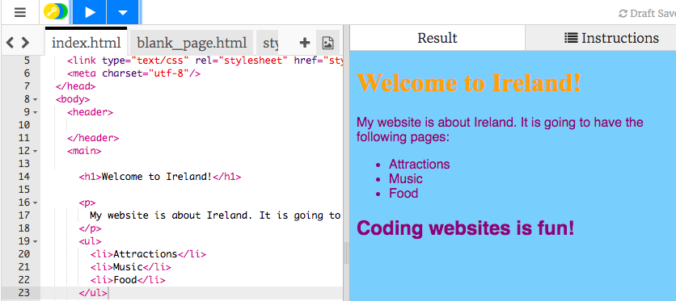
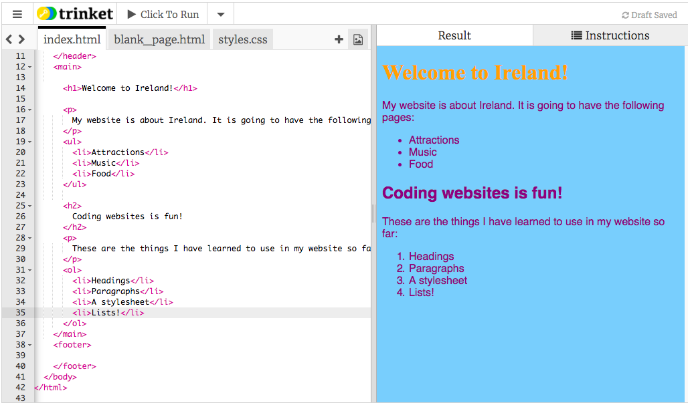

1. Keď máme v texte zoznam, nebolo by lepšie, ak by naozaj vyzeral ako zoznam? Existujú HTML tagy, ktoré slúžia presne na to! Choď naspať na záložku index.html a zmeň odstavec, tak aby vyzeral takto:
   ```html
   <p>
     My website is about Ireland. 
     It is going to have the following pages:
   </p>
   <ul>
     <li>Attractions</li>
     <li>Music</li>
     <li>Food</li>
   </ul>
```

2. Klikni na Run. Vidíš ako sa tvoj text usporiadal do pekného zoznamu? 

3. Tagy `<ul> </ul>` obklopujú celý zoznam. "ul" znamená **unordered list**, čiže zoznam bez poradia. To znamená zoznam bez čísel. Každá položka v zozname musí byť medzi tagmi `<li> </li>`. "li" znamená **list item**, čiže položka zoznamu.
  * Zmeň položky zoznamu na názvy stránok, ktoré by si chcel/a mať na svojej webovej stránke. Tvoja webová stránka môže byť o čomkoľvek chceš, nemusí byť o tvojej krajine!

4. Ak by sme chceli zoznam s číslami, vytvára sa skoro rovnako, len namiesto `ul`, použijeme `ol`. "ol" znamená **ordered list**, alebo zoradený zoznam. Pridaj tento kód pred uzatvárací tag `</main>`:
   ```html
   <p>
      These are the things I have learned to use in my website so far:
   </p>
   <ol>
      <li>Headings</li>
      <li>Paragraphs</li>
      <li>A stylesheet</li>
      <li>Lists!</li>
   </ol>
   ```
5. Klikni na Run. Tvoja stránka by teraz mala vyzerať približne takto: 


