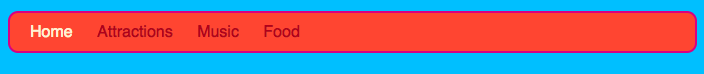
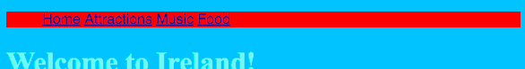

1. Pomocou **CSS** pravidiel v stylesheete môžeš premeniť tvoje navigačné menu na takýto štýlový panel! 

2. Prejdi do súboru so stylesheetom, styles.css. Pod poslednú zloženú zátvorku `}` pridaj toto pravidlo:

   ```css
      nav ul {
         background-color: tomato;
      }
   ```
   
3. Všimni si, že si použil/a **dva selektory** namiesto jedného. Ak by sme použili len samotný selektor `ul`, toto pravidlo by sa týkalo všetkých zoznamov typu `ul`, ktoré sa na tvojej webstránke nachádzajú. Tým, že sme pridali aj selektor `nav` sme pravidlo obmedzili len na `ul`zoznamy ktoré sa nachádzajú medzi tagmi `nav`.

4. Klikni na Run a skontroluj zmeny. 

5. Dajme preč odrážky – bodky pred položkami zoznamu. Prejdi na styles.css a pridaj nasledujúce pravidlo, opať pod poslednú zloženú zátvorku:   
   ```css
   nav ul li {
      list-style-type: none;
   }
   ```
Všimni si, že toto pravidlo má až tri selektory. Platí pre všetky tagy `li`, ktoré sú v `ul` zozname, ktorý je vo vnútri `nav` sekcie. Uf!
   
6. Teraz upravme zoznam tak, aby šiel horizontálne (v jednom riadku) a nie vertikálne (v jednom stĺpci). K pravidlu, ktoré si pridal/a v kroku 5, pridaj ešte tento riadok: `display: inline;`  

Všetky položky zoznamu sú teraz natlačené vedľa seba. Pridajme im okraje, aby sme ich rozmiestnili trocha lepšie. Okraje sa pridávajú pomocou `margin-right` (okraj vpravo) a `margin-left` (okraj vľavo). Pridaj ich takto:
   ```css
   nav ul li {
      list-style-type: none;
      display: inline;
      margin-right: 10px;
      margin-left: 10px;
   }
   ```
   `10px` znamená 10 **pixelov**.
   
7. Čo keby sme menu zmenili tak, aby nám ukazovalo, na ktorej podstránke sa práve nachádzame? Túto zmenu nespravíme v stylesheete, ale v html súboroch.

8. Začnime domovskou stránkou. Prejdi na súbor index.html. V zozname tvojho navigačného menu vymaž tagy odkazu pred a za slovom _Home_ (alebo _Domov_), tak, aby ti medzi tagmi `<li> </li>` zostal iba text, teda: `<li>Home</li>`.

9. Teraz sprav to isté v ostatných súboroch. Vždy vymaž tagy odkazu v tej položke, ktorá odkazuje na podstránku, ktorú upravuješ.

10. Klikni na Run a prejdi si podstránky. Všimni si, ako navigačné menu zobrazuje podstránku, na ktorej si ako text a nie ako odkaz. 
