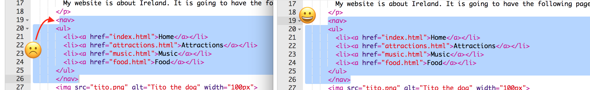

1. Väčšina webových stránok má **navigačné menu**, pomocou ktorého sa dá pohybovať medzi jednotlivými podstránkami. Teraz už máš niekoľko podstránok, domovskú stránku a odkazy medzi nimi. Presuň odkazy nahor. 

2. Pred tag `<ul>` vlož nový riadok a napíš doň tento tag: `<nav>`. Trinket ti automaticky doplní zatvárací tag `</nav>`. Zatvárací tag, teraz nepotrebujeme, možeš ho zmazať.
   * "nav" označuje **navigáciu**. Sekcia `nav` pozostáva s elementov pomocou ktorých sa dá pohybovať medzi podstránkami webovej stránky.


4. Now, select your entire `nav` section and list by clicking just before the opening `<nav>` tag and dragging the mouse all the way until just after the closing `</nav>` tag, so that all of the text including the opening and closing tags becomes highlighted. Make sure all of the **angle brackets** `<` and `>` at the start and end are highlighted too! 
5. You are going to **cut** this time instead of **copy**. Press and hold the **Ctrl** \(or **cmd**\) key and while holding it press the **X** key. The code will disappear but don't panic!
6. At the top of the file, click in the space between the `<header> </header>` tags. Make sure you see the cursor flashing there. Now **paste** in the code by pressing **Ctrl** \(or **cmd**\) and **V** together as usual. Click Run to see your changes! The code should look something like this:
   ```html
   <header>
      <nav>
         <ul>
            <li><a href="index.html">Home</a></li>
            <li><a href="attractions.html">Attractions</a></li>
            <li><a href="music.html">Music</a></li>
            <li><a href="food.html">Food</a></li>
         </ul>
      </nav>
   </header>
   ```

   * If you make a mistake, you can **undo** it by pressing **Ctrl** \(or **cmd**\) and **Z** together. You can usually press it a few times to undo the last couple of changes. This is another handy shortcut that you can use in many programs!
7. To make the navigation menu appear at the top of every page on your website, you put the same code into each new file that you created. Select the entire `nav` section like you did before, and press the **Ctrl** \(or **cmd**\) and **C** keys together to **copy** it. Then, in each of your other files, click inside the `<header> </header>` section and **paste** the code exactly like you did in Step 6.
9. Now when you click Run, you will be able to click the links no matter which page you are on. Remember to  click Save when you're done!


