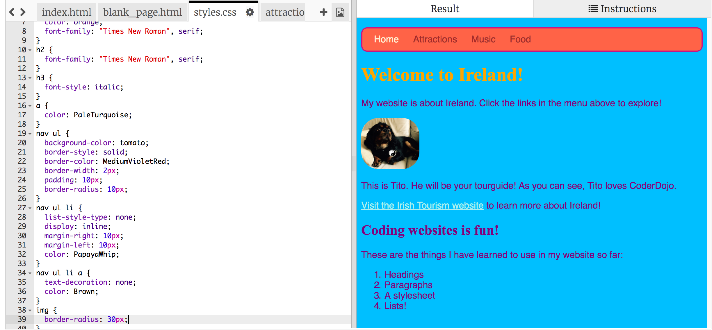

1. S CSS máš kopu možností, ako upraviť tvoje navigačné menu. Prejdi znovu na súbor styles.css. Vždy keď pridáš nejakú zmenu klikni na Run a pozri sa, ako tvoje zmeny vyzerajú.

2. Nájdi selektor `nav ul` a pridaj k nemu ďalšie pravidlá:
   ```css
      nav ul {
        background-color: tomato;
        border-style: solid;
        border-color: MediumVioletRed;
        border-width: 2px;
        padding: 10px;
      }
   ```
Vlastnosť `padding` (z angl. vypchávka, výplň), pridá viac priestoru. Vieš zistiť čo robia ostatné vlastnosti, ktoré sme pridali? Skús pomeniť farby a počet pixelov. 

3. Na to, aby sme odstránili podčiarknutie pri odkazoch, môžeme pridať nasledujúci kód za zloženou zátvorkou pre pravidlá k `nav ul li`.
   ```css
      nav ul li a {
         text-decoration: none;
      }
   ```
  * Toto pravidlo by sme mohli dať za ktorúkoľvek zloženú zátvorku, no je dobrým zvykom držať súvisiace pravidlá pokope.

  Predchádzajúce pravidlo platí pre odkazy (`<a>` tagy) v položkách zoznamu, ktoré sú vo vnútri zoznamu `<ul>` v sekcii navigácie (`nav`). Wow, štyri selektory! 
4. Pamätáš, ako sme v predchádzajúcej sekcii vymazali niektoré odkazy, aby sme videli na ktorej podstránke sa nachádzame? Môžeme zmeniť aj tie položky bez odkazov. Nájdi selektor `nav ul li` a pridaj riadok
   ```css
      color: PapayaWhip;
   ```
   medzi zložené zátvorky. Môžeš si vybrať ktorúkoľvek farbu.
  * Vlastnosť `color` môžeš pridať aj k pravidlám selektoru `nav ul li a`, a zmeniť tak farbu odkazov v navigačnom menu.
 
5. Čo tak zaobliť niektoré rohy. Pridaj nasledujúce pravidlo k selektoru `nav ul` a sleduj čo sa stane: `border-radius: 10px;`
  * Ak chceš, pridaj toto pravidlo ešte raz, tentoraz so selektorom `img`.

6. Tvoja stránka a stylesheet by teraz mali vyzerať približne takto: 
